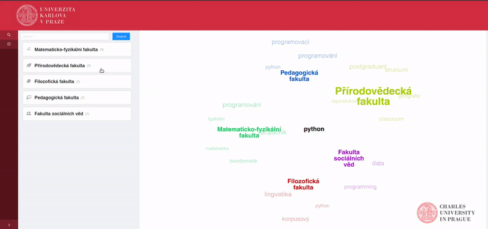

# Charles Explorer - Project proposal

Charles University consists of 17 faculties with 650+ study programs,
it has over 13 000 employees, 52 000 students and provides education in a total of 5 world languages.

Despite using the centralized SIS information system, finding information about classes, study programs, research groups, or lecturers is not always simple, both due to the convoluted structure of the available data and the outdated user environment of the SIS system. Many pieces of information are also accessible only via separate services.

The goal of this project is to develop a data-processing pipeline, consuming the data from the existing sources (the university databases) and automatically transforming this data into a comprehensive graph-based knowledge base.

This knowledge base will represent people, publications, classes, and study programs as individual entities and will model the relationships between those entities to provide a complex look into the university structure. Furthermore, it will also provide support for fast querying with intuitive queries based on the entity types, full-text search, and traversing the knowledge graph. It should also be accessible separately via a well-defined API (REST / SPARQL) to allow for further third-party development.

This knowledge base will serve as a base for the Charles Explorer web application. 
This application will provide the user with a comprehensive GUI, allowing them to run extensive queries and traverse and explore the entities and relationships in the knowledge graph via their web browser.

There are many different user personas for this application - be it a last-year student looking for thesis supervisors based on their fields of interest, a student applicant choosing their study program by exploring the courses, or a doctorand looking for related works and their authors to consult and cite in their diploma thesis.

