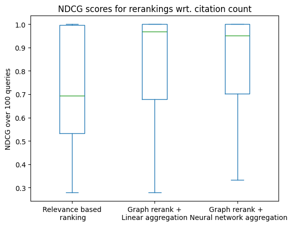

# Predicting the citation count from local graph measures

> This Python notebook shows the process of benchmarking the search result ranking for the Charles Explorer application.
> It is a part of my diploma thesis at the Faculty of Mathematics and Physics, Charles University, Prague.
>
> Find out more about the thesis in the [GitHub repository](https://github.com/barjin/master-thesis).
>
> Made by Jindřich Bär, 2024. 

As we have noticed before, the search results ranking we have acquired from Scopus is mostly based on the raw query relevance.
Because of this, it might be also riddled with the problems we have discussed in the thesis - such as the susceptibility to search engine optimization of certain papers.

In search for a better ranking for Charles Explorer, we try to predict the citation count of the papers based on the local graph measures we have calculated in the previous notebooks. The citation count is a good indicator of the importance of the paper that cannot be easily interfered with by the authors.
Unfortunately the citation count is not available in our dataset (hence the need for prediction / approximation of it).

For our previously acquired (balanced) dataset of representative queries and results, we collect the publication citation counts by querying the Scopus API.


```python
import pandas as pd

queries = pd.read_csv('./best_queries.csv')
scopus = pd.read_csv('./scopus_results.csv')
explorer = pd.read_csv('./filtered_search_results.csv')

charles = set(explorer['name'].str.lower().str.slice(0, 50))
elsevier = set(scopus['title'].str.lower().str.slice(0, 50))

explorer[~explorer['name'].str.lower().str.slice(0, 50).isin(elsevier)].reset_index(drop=True).to_csv('missing/explorer_missing.csv', index=False)
```


```python
import json
import subprocess

def get_query_object(query):
    return {
        "documentClassificationEnum": "primary",
        "query": f"TITLE-ABS-KEY({query})",
        "cluster": ["scoaffilctry,\"Czech Republic\",t"],
        "filters": {"yearFrom": "Before 1960","yearTo": "Present"},
        "sort": "r-f",
        "itemcount": 10,
        "offset": 0,
        "showAbstract": False
    }

def get_curl_call(query):
    return f"""curl\
 'https://www.scopus.com/api/documents/search'\
 --compressed\
 -s\
 -X POST\
 -H 'User-Agent: Mozilla/5.0 (X11; Linux x86_64; rv:126.0) Gecko/20100101 Firefox/126.0'\
 -H 'Accept: */*'\
 -H 'Accept-Language: en,cs;q=0.7,en-US;q=0.3'\
 -H 'Accept-Encoding: gzip, deflate, br, zstd'\
 -H 'content-type: application/json'\
 -H 'Origin: https://www.scopus.com'\
 -H 'Connection: keep-alive'\
 -H 'Cookie: SCSessionID=31A68011EC090B2C2D25409C367FD7A5.i-08c7b4cb90a86575e; scopusSessionUUID=4c0172ba-92b7-452f-b; scopus.machineID=31A68011EC090B2C2D25409C367FD7A5.i-08c7b4cb90a86575e; AWSELB=CB9317D502BF07938DE10C841E762B7A33C19AADB178C55D2587457546F4CC2EC9F7A3D245FD8F55BE465930D985598F19EDB4B09AA31AAC5A6BDE3E4B4DACF34F3854CEEBA41C0B8E02C8591C8E9694E78F7571EE; __cf_bm=QHSDXWknCNhCK.1Jk6zQuBuY2.TgrNE9ijPVSl_qNo4-1719667076-1.0.1.1-N8IMczb791yU81U3Ozhg9Ya8u4_0t3MnXVbhm0b.w7Dciz6KrxX1tZ0Y8UfMBHIP1aq4Ft1zacTw41y131kzag; _cfuvid=f2mprad0VaNiurnrtUrYr1Br4uwpTY3mIxGUaeXhWTo-1719667076015-0.0.1.1-604800000; SCOPUS_JWT=eyJraWQiOiJjYTUwODRlNi03M2Y5LTQ0NTUtOWI3Zi1kMjk1M2VkMmRiYmMiLCJhbGciOiJSUzI1NiJ9.eyJzdWIiOiIyODE3NDkyODEiLCJkZXBhcnRtZW50SWQiOiI0Mzg4NTciLCJpc3MiOiJTY29wdXMiLCJpbnN0X2FjY3RfaWQiOiI1MzA1MiIsImlzRXh0ZXJuYWxTdWJzY3JpYmVkRW50aXRsZW1lbnRzIjpmYWxzZSwicGF0aF9jaG9pY2UiOmZhbHNlLCJpbmR2X2lkZW50aXR5IjoiUkVHIiwiZXhwIjoxNzE5NjY3OTc3LCJpYXQiOjE3MTk2NjcwNzgsImVtYWlsIjoiMTM2ODcyNTRAY3VuaS5jeiIsImFuYWx5dGljc19pbmZvIjp7InVzZXJJZCI6ImFlOjI4MTc0OTI4MSIsImFjY2Vzc1R5cGUiOiJhZTpSRUc6U0hJQkJPTEVUSDpJTlNUOlNISUJCT0xFVEgiLCJhY2NvdW50TmFtZSI6IkNoYXJsZXMgVW5pdmVyc2l0eSIsImFjY291bnRJZCI6IjUzMDUyIn0sImRlcGFydG1lbnROYW1lIjoiU2hpYmJvbGV0aCIsImluc3RfYWNjdF9uYW1lIjoiQ2hhcmxlcyBVbml2ZXJzaXR5Iiwic3Vic2NyaWJlciI6dHJ1ZSwid2ViVXNlcklkIjoiMjgxNzQ5MjgxIiwiaW5zdF9hc3NvY19tZXRob2QiOiJTSElCQk9MRVRIIiwiZ2l2ZW5fbmFtZSI6IkppbmTFmWljaCIsImFjY291bnROdW1iZXIiOiJDMDAwMDUzMDUyIiwicGFja2FnZUlkcyI6W10sImF1ZCI6IlNjb3B1cyIsIm5iZiI6MTcxOTY2NzA3OCwiZmVuY2VzIjpbXSwiaW5kdl9pZGVudGl0eV9tZXRob2QiOiJTSElCQk9MRVRIIiwiaW5zdF9hc3NvYyI6IklOU1QiLCJuYW1lIjoiSmluZMWZaWNoIELDpHIiLCJ1c2FnZVBhdGhJbmZvIjoiKDI4MTc0OTI4MSxVfDQzODg1NyxEfDUzMDUyLEF8ODQ1MzYsU3w1LFB8MSxQTCkoU0NPUFVTLENPTnw1ZmRkNTMwZDRhMWNmMTRkMDM1YTNkNTI0OTBhOGYwY2M5MzJneHJxYSxTU098UkVHX1NISUJCT0xFVEgsQUNDRVNTX1RZUEUpIiwicHJpbWFyeUFkbWluUm9sZXMiOltdLCJhdXRoX3Rva2VuIjoiNWZkZDUzMGQ0YTFjZjE0ZDAzNWEzZDUyNDkwYThmMGNjOTMyZ3hycWEiLCJmYW1pbHlfbmFtZSI6IkLDpHIifQ.b4mQO49VcJWXnIXsMLWqpLPiFpTN9UAX9o1qRXKssB2EYv6WElIIdSh4fzDY7xzZIsfukS3WUbO57UG-cwf5ekHZilEEWS-X-2FmKAnm47tEdi_AopRt5bb1kaOHOCw0CP9TVUQwv50T7nuPO97DpOCA7KjN9u_59oCM7f2IxJ3chQjwXgU2jkoC1zlg_FKp1HBApdZK2NGN9URkJM7HVrLdRf2F6wM4uYu4gHKc9LrRUcRc6wYrAGOGqfLwyeaDel9_z-yv-2QOrhiSpOdlcOKpA0FjMJJmU4jlnLlc4nHDgwqutWX_p0ug4o1_zsRs2NJZJCSkCCjh492MApQKjw; Scopus-usage-key=enable-logging; AT_CONTENT_COOKIE="SERP_NEW_CTO:1,FEATURE_NEW_CITATION_OVERVIEW_IN_OLD_SERP:1,KDP_SOURCE_ENABLED:0,AUTH_NEW_CTO:1,FEATURE_NEW_CTO_AUTHOR_SEARCH:1,AUTH_NEW_CTO_CHART:1,KDP_FACADE_AFFILIATION_ENABLED:1,KDP_FACADE_ABSTRACT_ENABLED:1,FEATURE_SERVICE_FOR_METRICS:1,KDP_FACADE_PATENT_ENABLED:1,FEATURE_NEW_CTO_SOURCES:1,KDP_FACADE_AUTHOR_ENABLED:1,"; AMCV_4D6368F454EC41940A4C98A6%40AdobeOrg=-2121179033%7CMCIDTS%7C19904%7CMCMID%7C88067232839403622750793792218789971773%7CMCAID%7CNONE%7CMCOPTOUT-1719674281s%7CNONE%7CMCAAMLH-1720271881%7C6%7CMCAAMB-1720271881%7Cj8Odv6LonN4r3an7LhD3WZrU1bUpAkFkkiY1ncBR96t2PTI%7CMCCIDH%7C-1525754217%7CMCSYNCSOP%7C411-19911%7CvVersion%7C5.3.0; mbox=session#a48bb3160fc24266876c01004294eb63#1719668958|PC#a48bb3160fc24266876c01004294eb63.37_0#1782911898; at_check=true; __cfruid=dfc41b3af0a92df8102ae2c279f08d1b45e16cca-1719667080; cf_clearance=GD52LNNVT8hQoudVlbmFYVFnfmK.mOrfZq5tAs70fks-1719667080-1.0.1.1-J874riORMDtipuln.er0zzWHCrMaDGrv8mgyN4o4esCChW9M1PdoG7mTaRFvn2NsdKsn0Uh9M1n8UIyTbpfw_w; AMCVS_4D6368F454EC41940A4C98A6%40AdobeOrg=1; s_pers=%20c19%3Dsc%253Asearch%253Adocument%2520searchform%7C1719668881317%3B%20v68%3D1719667079654%7C1719668881319%3B%20v8%3D1719667095484%7C1814275095484%3B%20v8_s%3DFirst%2520Visit%7C1719668895484%3B; s_sess=%20e41%3D1%3B%20s_cpc%3D1%3B%20s_cc%3Dtrue%3B%20s_sq%3D%3B'\
 -H 'Sec-Fetch-Dest: empty'\
 -H 'Sec-Fetch-Mode: cors'\
 -H 'Sec-Fetch-Site: same-origin'\
 -H 'Priority: u=4'\
 -H 'Pragma: no-cache'\
 -H 'Cache-Control: no-cache'\
 -H 'TE: trailers' \
 --data-raw '{json.dumps(get_query_object(query))}'"""

def call_scopus_api(query):
    result = subprocess.run(get_curl_call(query), check=True, shell=True, stdout=subprocess.PIPE)
    return json.loads(result.stdout.decode('utf-8'))
```


```python

import pandas as pd
import re

missing_publications = pd.read_csv('missing/explorer_missing.csv')
missing_names = missing_publications['name'].str.lower().str.slice(0, 50).unique()

pub_data = pd.read_csv('missing/scopus_new_data_complete.csv')

for i, name in enumerate(list(missing_names[3040:])):
    try:
        result = call_scopus_api(re.sub('[^0-9a-zA-Z\s]+', ' ', name))['items']
        if pub_data is None:
            pub_data = pd.DataFrame.from_dict(result)
        else:
            x = pd.concat([pub_data, pd.DataFrame.from_dict(result)])
            pub_data = x

        if i % 10 == 0:
            print(f"Processed {3040+i}/{len(missing_names)}")
    except Exception as e:
        print(f"Error processing {name}: {e}")
        continue
        
    pub_data.to_csv('missing/scopus_new_data_complete.csv', index=False)

```

    Processed 3040/7189
    Processed 3050/7189
    Processed 3060/7189
    Processed 3070/7189
    Processed 3080/7189
    Processed 3090/7189
    Processed 3100/7189
    Processed 3110/7189
    Processed 3120/7189
    Processed 3130/7189
    Processed 3140/7189
    Processed 3150/7189
    Processed 3160/7189
    Processed 3170/7189
    Processed 3180/7189
    Processed 3190/7189
    Processed 3200/7189
    Processed 3210/7189
    Processed 3220/7189
    Processed 3230/7189
    Processed 3240/7189
    Processed 3250/7189
    Processed 3260/7189
    Processed 3270/7189
    Processed 3280/7189
    Processed 3290/7189
    Processed 3300/7189
    Processed 3310/7189
    Processed 3320/7189
    Processed 3330/7189
    Processed 3340/7189
    Processed 3350/7189
    Error processing dentin hypersensitivity - green or: 'items'
    Error processing dentin hypersensitivity - green or : 'items'
    Processed 3360/7189
    Processed 3370/7189
    Processed 3380/7189
    Processed 3390/7189
    Processed 3400/7189
    Processed 3410/7189
    Processed 3420/7189
    Processed 3430/7189
    Processed 3440/7189
    Processed 3450/7189
    Processed 3460/7189
    Processed 3470/7189
    Processed 3480/7189
    Processed 3490/7189
    Processed 3500/7189
    Processed 3510/7189
    Processed 3520/7189
    Processed 3530/7189
    Processed 3540/7189
    Processed 3550/7189
    Processed 3560/7189
    Processed 3570/7189
    Processed 3580/7189
    Error processing the labour law regulation of employee control and : 'items'
    Processed 3590/7189
    Processed 3600/7189
    Processed 3610/7189
    Processed 3620/7189
    Error processing strychnine as a poison and or matter in experiment: 'items'
    Processed 3630/7189
    Processed 3640/7189
    Processed 3650/7189
    Processed 3660/7189
    Processed 3670/7189
    Processed 3680/7189
    Processed 3690/7189
    Error processing musical activities in czech as a mother tongue and: 'items'
    Processed 3700/7189
    Processed 3710/7189
    Processed 3720/7189
    Processed 3730/7189
    Processed 3740/7189
    Error processing the elbing vocabulary in translation: methods and : 'items'
    Processed 3750/7189
    Processed 3760/7189
    Processed 3770/7189
    Processed 3780/7189
    Processed 3790/7189
    Processed 3800/7189
    Processed 3810/7189
    Processed 3820/7189
    Processed 3830/7189
    Processed 3840/7189
    Processed 3850/7189
    Processed 3860/7189
    Processed 3870/7189
    Processed 3880/7189
    Processed 3890/7189
    Error processing to the latest amendment of the mark of origin and : 'items'
    Error processing proceedings of the czech geographical society and : 'items'
    Processed 3910/7189
    Processed 3920/7189
    Processed 3930/7189
    Processed 3940/7189
    Processed 3950/7189
    Error processing give blood and and you will receive the spirit. li: 'items'
    Error processing the habsburg monarchy, emperor franz joseph i, and: 'items'
    Processed 3960/7189
    Processed 3970/7189
    Processed 3980/7189
    Processed 3990/7189
    Processed 4000/7189
    Processed 4010/7189
    Error processing contribution of botanists of 19th century born and: 'items'
    Processed 4020/7189
    Processed 4030/7189
    Processed 4040/7189
    Processed 4050/7189
    Processed 4060/7189
    Processed 4070/7189
    Processed 4080/7189
    Processed 4090/7189
    Processed 4100/7189
    Processed 4110/7189
    Processed 4120/7189
    Processed 4130/7189
    Processed 4140/7189
    Error processing mechanism of action of atypical antipsychotics and: 'items'
    Processed 4150/7189
    Processed 4160/7189
    Processed 4170/7189
    Processed 4180/7189
    Processed 4190/7189
    Processed 4200/7189
    Processed 4210/7189
    Processed 4220/7189
    Processed 4230/7189
    Processed 4240/7189
    Processed 4250/7189
    Processed 4260/7189
    Processed 4270/7189
    Processed 4280/7189
    Processed 4290/7189
    Processed 4300/7189
    Processed 4310/7189
    Processed 4320/7189
    Processed 4330/7189
    Processed 4340/7189
    Processed 4350/7189
    Processed 4360/7189
    Error processing which taxa are alien? criteria, applications, and : 'items'
    Processed 4370/7189
    Processed 4380/7189
    Processed 4390/7189
    Processed 4400/7189
    Processed 4410/7189
    Processed 4420/7189
    Processed 4430/7189
    Processed 4440/7189
    Processed 4450/7189
    Processed 4460/7189
    Error processing majority society and its coexistence with arab and: 'items'
    Processed 4470/7189
    Processed 4480/7189
    Processed 4490/7189
    Processed 4500/7189
    Processed 4510/7189
    Processed 4520/7189
    Processed 4530/7189
    Processed 4540/7189
    Processed 4550/7189
    Error processing natural history study of stxbp1-developmental and : 'items'
    Processed 4560/7189
    Error processing morphine exposure prevents up-regulation of mr and: 'items'
    Processed 4570/7189
    Processed 4580/7189
    Processed 4590/7189
    Processed 4600/7189
    Processed 4610/7189
    Processed 4620/7189
    Processed 4630/7189
    Processed 4640/7189
    Processed 4650/7189
    Processed 4660/7189
    Processed 4670/7189
    Processed 4680/7189
    Processed 4690/7189
    Processed 4700/7189
    Processed 4710/7189
    Processed 4720/7189
    Processed 4730/7189
    Processed 4740/7189
    Error processing hot conflict in the cold arctic : geopolitics and : 'items'
    Processed 4750/7189
    Processed 4760/7189
    Processed 4770/7189
    Processed 4780/7189
    Processed 4790/7189
    Processed 4800/7189
    Processed 4810/7189
    Processed 4820/7189
    Processed 4830/7189
    Processed 4840/7189
    Processed 4850/7189
    Processed 4860/7189
    Processed 4870/7189
    Processed 4880/7189
    Processed 4890/7189
    Processed 4900/7189
    Processed 4910/7189
    Processed 4920/7189
    Processed 4930/7189
    Processed 4940/7189
    Processed 4950/7189
    Processed 4960/7189
    Processed 4970/7189
    Processed 4980/7189
    Processed 4990/7189
    Processed 5000/7189
    Processed 5010/7189
    Processed 5020/7189
    Processed 5030/7189
    Processed 5040/7189
    Processed 5050/7189
    Processed 5060/7189
    Processed 5070/7189
    Error processing not only for gravediggers: the book of burial and : 'items'
    Error processing stable angina pectoris: recommended diagnostic and: 'items'
    Processed 5080/7189
    Error processing congresses of czech (czechoslovak) naturalists and: 'items'
    Processed 5090/7189
    Processed 5100/7189
    Processed 5110/7189
    Processed 5120/7189
    Processed 5130/7189
    Processed 5140/7189
    Processed 5150/7189
    Error processing adaptation of the child to the foreign culture and: 'items'
    Processed 5160/7189
    Processed 5170/7189
    Processed 5180/7189
    Processed 5190/7189
    Error processing specification of eating disorders in children and : 'items'
    Processed 5200/7189
    Processed 5210/7189
    Processed 5220/7189
    Processed 5230/7189
    Processed 5240/7189
    Processed 5250/7189
    Processed 5260/7189
    Processed 5270/7189
    Processed 5280/7189
    Processed 5290/7189
    Processed 5300/7189
    Processed 5310/7189
    Error processing blood serum level of ths and thyroid hormones and : 'items'
    Processed 5320/7189
    Processed 5330/7189
    Processed 5340/7189
    Processed 5350/7189
    Processed 5360/7189
    Processed 5370/7189
    Processed 5380/7189
    Processed 5390/7189
    Processed 5400/7189
    Processed 5410/7189
    Processed 5420/7189
    Processed 5430/7189
    Processed 5440/7189
    Processed 5450/7189
    Processed 5460/7189
    Processed 5470/7189
    Processed 5480/7189
    Processed 5490/7189
    Processed 5500/7189
    Processed 5510/7189
    Processed 5520/7189
    Processed 5530/7189
    Processed 5540/7189
    Processed 5550/7189
    Processed 5560/7189
    Processed 5570/7189
    Processed 5580/7189
    Processed 5590/7189
    Processed 5600/7189
    Processed 5610/7189
    Processed 5620/7189
    Processed 5630/7189
    Processed 5640/7189
    Processed 5650/7189
    Processed 5660/7189
    Processed 5670/7189
    Processed 5680/7189
    Processed 5690/7189
    Processed 5700/7189
    Processed 5710/7189
    Processed 5720/7189
    Error processing relationship between diastasis recti abdominis and: 'items'
    Processed 5730/7189
    Processed 5740/7189
    Processed 5750/7189
    Processed 5760/7189
    Processed 5770/7189
    Processed 5780/7189
    Processed 5790/7189
    Processed 5800/7189
    Processed 5810/7189
    Processed 5820/7189
    Processed 5830/7189
    Processed 5840/7189
    Processed 5850/7189
    Processed 5860/7189
    Processed 5870/7189
    Processed 5880/7189
    Processed 5890/7189
    Processed 5900/7189
    Processed 5910/7189
    Processed 5920/7189
    Error processing decrease of olfactory and gustatory functions and : 'items'
    Processed 5930/7189
    Processed 5940/7189
    Processed 5950/7189
    Processed 5960/7189
    Processed 5970/7189
    Processed 5980/7189
    Processed 5990/7189
    Error processing oral enzyme therapy - principles of absorption and: 'items'
    Processed 6000/7189
    Processed 6010/7189
    Processed 6020/7189
    Processed 6030/7189
    Processed 6040/7189
    Processed 6050/7189
    Processed 6060/7189
    Processed 6070/7189
    Processed 6080/7189
    Processed 6090/7189
    Processed 6100/7189
    Processed 6110/7189
    Processed 6120/7189
    Processed 6130/7189
    Processed 6140/7189
    Processed 6150/7189
    Processed 6160/7189
    Processed 6170/7189
    Processed 6180/7189
    Processed 6190/7189
    Processed 6200/7189
    Processed 6210/7189
    Processed 6220/7189
    Processed 6230/7189
    Processed 6240/7189
    Processed 6250/7189
    Processed 6260/7189
    Processed 6270/7189
    Processed 6280/7189
    Processed 6290/7189
    Processed 6300/7189
    Processed 6310/7189
    Processed 6320/7189
    Processed 6330/7189
    Processed 6340/7189
    Processed 6350/7189
    Processed 6360/7189
    Processed 6370/7189
    Processed 6380/7189
    Processed 6390/7189
    Processed 6400/7189
    Error processing attitudes of intensivists to limiting therapy and : 'items'
    Processed 6420/7189
    Processed 6430/7189
    Processed 6440/7189
    Processed 6450/7189
    Processed 6460/7189
    Processed 6470/7189
    Processed 6480/7189
    Error processing the historical lexicon. dictionaries of texts and : 'items'
    Processed 6490/7189
    Error processing the rise of colligations. english can’t stand and : 'items'
    Processed 6500/7189
    Processed 6510/7189
    Processed 6520/7189
    Processed 6530/7189
    Processed 6540/7189
    Processed 6550/7189
    Processed 6560/7189
    Processed 6570/7189
    Error processing a walk along the royal road: prague, tourists, and: 'items'
    Processed 6580/7189
    Processed 6590/7189
    Processed 6600/7189
    Processed 6610/7189
    Error processing electronic prescription in the czech republic and : 'items'
    Processed 6620/7189
    Processed 6630/7189
    Processed 6640/7189
    Processed 6650/7189
    Processed 6660/7189
    Processed 6670/7189
    Processed 6680/7189
    Processed 6690/7189
    Processed 6700/7189
    Processed 6710/7189
    Processed 6720/7189
    Processed 6730/7189
    Processed 6740/7189
    Error processing meningitis and meningoencephalitis in children and: 'items'
    Processed 6750/7189
    Processed 6760/7189
    Processed 6770/7189
    Processed 6780/7189
    Processed 6790/7189
    Error processing hamiltonian coupling of electromagnetic field and : 'items'
    Processed 6800/7189
    Processed 6810/7189
    Processed 6820/7189
    Processed 6830/7189
    Processed 6840/7189
    Processed 6850/7189
    Processed 6860/7189
    Processed 6870/7189
    Processed 6880/7189
    Processed 6890/7189
    Processed 6900/7189
    Processed 6910/7189
    Processed 6920/7189
    Processed 6930/7189
    Processed 6940/7189
    Processed 6950/7189
    Error processing xxxiii. motol workshop of pediatric cardiology and: 'items'
    Processed 6960/7189
    Processed 6970/7189
    Processed 6980/7189
    Processed 6990/7189
    Processed 7000/7189
    Processed 7010/7189
    Processed 7020/7189
    Processed 7030/7189
    Processed 7040/7189
    Processed 7050/7189
    Processed 7060/7189
    Processed 7070/7189
    Processed 7080/7189
    Processed 7090/7189
    Processed 7100/7189
    Processed 7110/7189
    Processed 7120/7189
    Error processing the ctla4 variants may interact with the il23r-and: 'items'
    Processed 7130/7189
    Processed 7140/7189
    Error processing šubrt jiří: the systemic approach in sociology and: 'items'
    Processed 7150/7189
    Error processing multi-agent systems in theories of f. a. hayek and: 'items'
    Processed 7160/7189
    Processed 7170/7189
    Error processing niklas luhmann and forms of the baroque modern; or: 'items'
    Processed 7180/7189


```python
import pandas as pd
import re

loaded = pd.read_csv('missing/scopus_new_data_complete.csv')
missing = pd.read_csv('missing/explorer_missing.csv')

missing['index'] = missing.index
missing['normalized_name'] = missing['name'].apply(lambda x: re.sub('[^0-9a-zA-Z\s]+', ' ', x).lower()[0:50])

loaded['normalized_name'] = loaded['title'].apply(lambda x: re.sub('[^0-9a-zA-Z\s]+', ' ', x).lower()[0:50])
loaded.set_index('normalized_name', inplace=True)

joined = missing.join(loaded, on='normalized_name', how='left')
joined = joined[~joined['title'].isna()]
```


```python
import ast

joined['citation_count'] = joined['citations'].map(lambda x: ast.literal_eval(x)['count'])

filtered = pd.DataFrame(joined[['id', 'name', 'citation_count']])
filtered.reset_index(drop=True).to_csv('missing/citation_counts.csv', index=False)
```

In the process described with the code cells above, go over a set of `7189` publications we have retrieved from Charles Explorer and try to match them to publications in Scopus by their name. If the match is found, we store the citation count in a new column.

In the case of our balanced dataset, we have found a match for `962` publications.
While this might seem low, it still provides us with a good enough dataset to train and test our models.

As the next step, we load the graph measures we have calculated in the previous notebooks and join those with the records containing the citation counts.


```python
import pandas as pd

katz = pd.read_csv('katz.csv')
node_cuts = pd.read_csv('node_cuts.csv')
centrality = pd.read_csv('local_centrality.csv')
degrees = pd.read_csv('degrees.csv')

citations = pd.read_csv('missing/citation_counts.csv')

df = citations.merge(
    katz, left_on='id', right_on='id', how='left'
).merge(
    node_cuts, left_on='id', right_on='id', how='left'
).merge(
    centrality, left_on='id', right_on='id', how='left'
).merge(
    degrees, left_on='id', right_on='id', how='left'
)
```


```python
df
```


<div>
<style scoped>
    .dataframe tbody tr th:only-of-type {
        vertical-align: middle;
    }

    .dataframe tbody tr th {
        vertical-align: top;
    }

    .dataframe thead th {
        text-align: right;
    }
</style>
<table border="1" class="dataframe">
  <thead>
    <tr style="text-align: right;">
      <th></th>
      <th>id</th>
      <th>name</th>
      <th>citation_count</th>
      <th>katz_centrality</th>
      <th>node_cut</th>
      <th>query_x</th>
      <th>centrality_1</th>
      <th>centrality_2</th>
      <th>query_y</th>
      <th>degree</th>
      <th>query</th>
    </tr>
  </thead>
  <tbody>
    <tr>
      <th>0</th>
      <td>80319</td>
      <td>Deception in social psychological experiments:...</td>
      <td>40</td>
      <td>0.4000</td>
      <td>99</td>
      <td>social psychology</td>
      <td>0.000015</td>
      <td>0.000005</td>
      <td>social psychology</td>
      <td>2</td>
      <td>social psychology</td>
    </tr>
    <tr>
      <th>1</th>
      <td>323832</td>
      <td>Epilogue</td>
      <td>0</td>
      <td>0.2000</td>
      <td>189</td>
      <td>social psychology</td>
      <td>0.000000</td>
      <td>0.000000</td>
      <td>social psychology</td>
      <td>1</td>
      <td>social psychology</td>
    </tr>
    <tr>
      <th>2</th>
      <td>571872</td>
      <td>Stereotypes, norms, and political correctness</td>
      <td>2</td>
      <td>0.2000</td>
      <td>56</td>
      <td>social psychology</td>
      <td>0.000000</td>
      <td>0.000000</td>
      <td>social psychology</td>
      <td>1</td>
      <td>social psychology</td>
    </tr>
    <tr>
      <th>3</th>
      <td>510254</td>
      <td>Signs of Myelin Impairment in Cerebrospinal Fl...</td>
      <td>10</td>
      <td>0.6000</td>
      <td>283</td>
      <td>clinical neurology</td>
      <td>0.000082</td>
      <td>0.000306</td>
      <td>clinical neurology</td>
      <td>3</td>
      <td>clinical neurology</td>
    </tr>
    <tr>
      <th>4</th>
      <td>512548</td>
      <td>Atypical language representation in children w...</td>
      <td>10</td>
      <td>1.6000</td>
      <td>208</td>
      <td>clinical neurology</td>
      <td>0.000765</td>
      <td>0.004019</td>
      <td>clinical neurology</td>
      <td>8</td>
      <td>clinical neurology</td>
    </tr>
    <tr>
      <th>...</th>
      <td>...</td>
      <td>...</td>
      <td>...</td>
      <td>...</td>
      <td>...</td>
      <td>...</td>
      <td>...</td>
      <td>...</td>
      <td>...</td>
      <td>...</td>
      <td>...</td>
    </tr>
    <tr>
      <th>1231</th>
      <td>533264</td>
      <td>Selective IgM deficiency: clinical and laborat...</td>
      <td>26</td>
      <td>1.4000</td>
      <td>127</td>
      <td>immunopathology</td>
      <td>0.000360</td>
      <td>0.000809</td>
      <td>immunopathology</td>
      <td>7</td>
      <td>immunopathology</td>
    </tr>
    <tr>
      <th>1232</th>
      <td>477343</td>
      <td>Two types of CMV ocular complications in patie...</td>
      <td>2</td>
      <td>1.0000</td>
      <td>343</td>
      <td>immunopathology</td>
      <td>0.000171</td>
      <td>0.005273</td>
      <td>immunopathology</td>
      <td>5</td>
      <td>immunopathology</td>
    </tr>
    <tr>
      <th>1233</th>
      <td>641559</td>
      <td>Kirche der Freiheit and A Systems Theory Of Ch...</td>
      <td>0</td>
      <td>0.3584</td>
      <td>2</td>
      <td>systems theory</td>
      <td>0.000000</td>
      <td>0.000000</td>
      <td>systems theory</td>
      <td>1</td>
      <td>systems theory</td>
    </tr>
    <tr>
      <th>1234</th>
      <td>168916</td>
      <td>On the Issue of Learning of Social Science in ...</td>
      <td>0</td>
      <td>0.4000</td>
      <td>214</td>
      <td>systems theory</td>
      <td>0.001700</td>
      <td>0.000072</td>
      <td>systems theory</td>
      <td>2</td>
      <td>systems theory</td>
    </tr>
    <tr>
      <th>1235</th>
      <td>639120</td>
      <td>Sport Migration Influences on Cultural Brand I...</td>
      <td>1</td>
      <td>0.4000</td>
      <td>54</td>
      <td>systems theory</td>
      <td>0.000204</td>
      <td>0.001406</td>
      <td>systems theory</td>
      <td>2</td>
      <td>systems theory</td>
    </tr>
  </tbody>
</table>
<p>1236 rows × 11 columns</p>
</div>


To see whether there is any correlation between the citation count and the graph measures, we calculate the correlation matrix on the graph measures and the citation count per publication.


```python
df[['citation_count', 'katz_centrality', 'node_cut', 'centrality_1', 'centrality_2', 'degree']].corr()
```


<div>
<style scoped>
    .dataframe tbody tr th:only-of-type {
        vertical-align: middle;
    }

    .dataframe tbody tr th {
        vertical-align: top;
    }

    .dataframe thead th {
        text-align: right;
    }
</style>
<table border="1" class="dataframe">
  <thead>
    <tr style="text-align: right;">
      <th></th>
      <th>citation_count</th>
      <th>katz_centrality</th>
      <th>node_cut</th>
      <th>centrality_1</th>
      <th>centrality_2</th>
      <th>degree</th>
    </tr>
  </thead>
  <tbody>
    <tr>
      <th>citation_count</th>
      <td>1.000000</td>
      <td>0.282355</td>
      <td>0.071930</td>
      <td>0.134054</td>
      <td>0.003482</td>
      <td>0.368689</td>
    </tr>
    <tr>
      <th>katz_centrality</th>
      <td>0.282355</td>
      <td>1.000000</td>
      <td>0.046096</td>
      <td>0.251490</td>
      <td>0.062201</td>
      <td>0.819643</td>
    </tr>
    <tr>
      <th>node_cut</th>
      <td>0.071930</td>
      <td>0.046096</td>
      <td>1.000000</td>
      <td>0.119445</td>
      <td>0.176158</td>
      <td>0.148508</td>
    </tr>
    <tr>
      <th>centrality_1</th>
      <td>0.134054</td>
      <td>0.251490</td>
      <td>0.119445</td>
      <td>1.000000</td>
      <td>0.576928</td>
      <td>0.307011</td>
    </tr>
    <tr>
      <th>centrality_2</th>
      <td>0.003482</td>
      <td>0.062201</td>
      <td>0.176158</td>
      <td>0.576928</td>
      <td>1.000000</td>
      <td>0.091475</td>
    </tr>
    <tr>
      <th>degree</th>
      <td>0.368689</td>
      <td>0.819643</td>
      <td>0.148508</td>
      <td>0.307011</td>
      <td>0.091475</td>
      <td>1.000000</td>
    </tr>
  </tbody>
</table>
</div>


Note that this is in (approximately) in line with the results of experiments conducted by Alireza Abbasi and Jörn Altmann in https://doi.org/10.1016/j.joi.2011.05.007 .

<!-- @article{ABBASI2011594,
title = {Identifying the effects of co-authorship networks on the performance of scholars: A correlation and regression analysis of performance measures and social network analysis measures},
journal = {Journal of Informetrics},
volume = {5},
number = {4},
pages = {594-607},
year = {2011},
issn = {1751-1577},
doi = {https://doi.org/10.1016/j.joi.2011.05.007},
url = {https://www.sciencedirect.com/science/article/pii/S1751157711000630},
author = {Alireza Abbasi and Jörn Altmann and Liaquat Hossain},
keywords = {Collaboration, Citation-based research performance, -index, Co-authorship networks, Social network analysis measures, Regression, Correlation},
abstract = {In this study, we develop a theoretical model based on social network theories and analytical methods for exploring collaboration (co-authorship) networks of scholars. We use measures from social network analysis (SNA) (i.e., normalized degree centrality, normalized closeness centrality, normalized betweenness centrality, normalized eigenvector centrality, average ties strength, and efficiency) for examining the effect of social networks on the (citation-based) performance of scholars in a given discipline (i.e., information systems). Results from our statistical analysis using a Poisson regression model suggest that research performance of scholars (g-index) is positively correlated with four SNA measures except for the normalized betweenness centrality and the normalized closeness centrality measures. Furthermore, it reveals that only normalized degree centrality, efficiency, and average ties strength have a positive significant influence on the g-index (as a performance measure). The normalized eigenvector centrality has a negative significant influence on the g-index. Based on these results, we can imply that scholars, who are connected to many distinct scholars, have a better citation-based performance (g-index) than scholars with fewer connections. Additionally, scholars with large average ties strengths (i.e., repeated co-authorships) show a better research performance than those with low tie strengths (e.g., single co-authorships with many different scholars). The results related to efficiency show that scholars, who maintain a strong co-authorship relationship to only one co-author of a group of linked co-authors, perform better than those researchers with many relationships to the same group of linked co-authors. The negative effect of the normalized eigenvector suggests that scholars should work with many students instead of other well-performing scholars. Consequently, we can state that the professional social network of researchers can be used to predict the future performance of researchers.}
} -->

We see that the the highest correlation between two variables is `0.8196` between the `katz_centrality` and `degree`. This is partially expected from the definition of the Katz centrality, which iteratively - with growing distance - sums the number of nodes reachable from the given node in this distance.

Aside from this correlation, we also see a correlation between the ego- and 2-hop-neighborhood betweenness centralities. This is also expected, as the 2-hop-neighborhood considered in the second measure is a superset of the ego-neighborhood and might capture the similar information.

As for the correlation with the citation count, we see that the highest correlation is with the `degree` measure, which is `0.3687`. This is a good sign, as the degree is a simple measure of the number of connections of the node. It also partially confirms out assumption that the publication degree can be a good proxy for a publication importance - and that publications with more coauthors tend to be more cited. Perhaps due to the high correlation between the `degree` and Katz centrality, the katz centrality also shows a good correlation with the citation count.

To see how well the graph measures can predict the citation count, we train the same models as in the previous experiment - a simple linear regression model and a neural network model.


```python
## Using sklearn, we learn a neural network model to predict the location of the document in the Scopus Search results
from sklearn.pipeline import Pipeline
from sklearn.preprocessing import StandardScaler
from sklearn.model_selection import train_test_split
from sklearn.metrics import mean_squared_error
from sklearn.linear_model import Ridge

projection = df[[
    'id',
    'centrality_1', 'centrality_2', 
    'degree', 
    'katz_centrality', 'node_cut', 
    'citation_count']].dropna()
projection['katz_centrality'] = projection['katz_centrality'].replace([float('inf')], projection['katz_centrality'].median())

feature_columns = ['centrality_1', 'centrality_2', 'degree', 'katz_centrality', 'node_cut']

X = projection[[*feature_columns, 'id']]
y = projection['citation_count']

X_train, X_test, y_train, y_test = train_test_split(X, y, test_size=0.2, random_state=42)

linear_model = Ridge()

linear_pipeline = Pipeline([
    ('scaler', StandardScaler()),
    ('linear', linear_model)
])

linear_pipeline.fit(X_train[feature_columns], y_train)

y_pred = linear_pipeline.predict(X_test[feature_columns])

print(f"MSE: {mean_squared_error(y_test, y_pred)}")
print(list(zip(feature_columns, linear_model.coef_)))
```

    MSE: 6725.050765413087
    [('centrality_1', 13.606487405580742), ('centrality_2', -12.04390116805357), ('degree', 35.422981810917456), ('katz_centrality', -5.464560624987053), ('node_cut', 3.060149167695211)]


```python
from sklearn.neural_network import MLPRegressor

neural_network = MLPRegressor(max_iter=1000, hidden_layer_sizes=(100, 100))

pipeline = Pipeline([
    ('scaler', StandardScaler()),
    ('neural_network', neural_network)
])

pipeline.fit(X_train[feature_columns], y_train)

y_pred = pipeline.predict(X_test[feature_columns])
print(f"MSE: {mean_squared_error(y_test, y_pred)}")
```

    MSE: 7425.5727259536125


We see that unlike in the reranking experiment, the regularized linear regression did better than the neural network. 
Both of the method performed quite bad, though - with the linear regression having a mean squared error of `6725.0508` and the neural network having a mean squared error of `7517.2390`.

As expected from the correlation matrix exploration, the linear regression model has the highest coefficient for the `degree` measure, which is `35.4230`. The coefficient for the other measures is quite low (even negative at points), which might be due to the high correlation between the `degree` and the other measures.

This is also in line with the expermients conducted in https://doi.org/10.1016/j.joi.2011.05.007 - while they use a variable called `degree centrality`, this is simply the node degree in the graph.

While the results of these experiments do not seem to provide much insight into the citation count prediction, we still might try to utilize them for the search result ranking in the Charles Explorer application.

## Citation-based ranking

Note that the ranking benchmarks (and human users of search engines) might not be interested in the exact citation count, but rather in the relative importance of the publications. Both benchmarks and users also tend to discount the publications further down in the search result list.

Because of our original goal, i.e. reorder the search results to set the more "globally" important papers higher - we might try to use the graph measures to reorder the search results with better results. We calculate the ndcg score with the citation count as the relevance feedback and the predicted citation count as the ordering.

We start by utilizing the graph measures to predict the citation count for the publications and add this as a new attribute column.


```python
df.dropna(inplace=True)
df['katz_centrality'] = df['katz_centrality'].replace([float('inf')], df['katz_centrality'].median())

df['predicted_citation_count_l'] = linear_pipeline.predict(df[feature_columns])
df['predicted_citation_count_n'] = pipeline.predict(df[feature_columns])
```


```python
from typing import List
import numpy as np
import pandas as pd

def get_dcg(relevances: List[int]):
    dcg = 0
    for i, relevance in enumerate(relevances):
        dcg += relevance / np.log2(i + 2)
    return dcg

original_dcgs = []
idcgs = []
reranked_dcgs_l = []
reranked_dcgs_n = []

for query in df['query'].unique():
    original_dcgs.append(get_dcg(df[df['query'] == query]['citation_count']))
    idcgs.append(get_dcg(df[df['query'] == query]['citation_count'].sort_values(ascending=False)))
    reranked_dcgs_l.append(get_dcg(df[df['query'] == query].sort_values('predicted_citation_count_l', ascending=False)['citation_count']))
    reranked_dcgs_n.append(get_dcg(df[df['query'] == query].sort_values('predicted_citation_count_n', ascending=False)['citation_count']))

dcgs = pd.DataFrame({
    'query': df['query'].unique(),
    'original_ndcg': np.array(original_dcgs) / np.array(idcgs),
    'reranked_ndcg_l': np.array(reranked_dcgs_l) / np.array(idcgs),
    'reranked_ndcg_n': np.array(reranked_dcgs_n) / np.array(idcgs)
})

pl = dcgs.plot(kind='box')
pl.set_title('NDCG scores for rerankings wrt. citation count')
pl.set_ylabel('NDCG over 100 queries')
pl.set_xticklabels(['Relevance based\n ranking', 'Graph rerank +\nLinear aggregation', 'Graph rerank + \n Neural network aggregation'])
```

    /tmp/ipykernel_133778/2283712701.py:24: RuntimeWarning: invalid value encountered in divide
      'original_ndcg': np.array(original_dcgs) / np.array(idcgs),
    /tmp/ipykernel_133778/2283712701.py:25: RuntimeWarning: invalid value encountered in divide
      'reranked_ndcg_l': np.array(reranked_dcgs_l) / np.array(idcgs),
    /tmp/ipykernel_133778/2283712701.py:26: RuntimeWarning: invalid value encountered in divide
      'reranked_ndcg_n': np.array(reranked_dcgs_n) / np.array(idcgs)


    [Text(1, 0, 'Relevance based\n ranking'),
     Text(2, 0, 'Graph rerank +\nLinear aggregation'),
     Text(3, 0, 'Graph rerank + \n Neural network aggregation')]


    

    


```python
dcgs.describe()
```


<div>
<style scoped>
    .dataframe tbody tr th:only-of-type {
        vertical-align: middle;
    }

    .dataframe tbody tr th {
        vertical-align: top;
    }

    .dataframe thead th {
        text-align: right;
    }
</style>
<table border="1" class="dataframe">
  <thead>
    <tr style="text-align: right;">
      <th></th>
      <th>original_ndcg</th>
      <th>reranked_ndcg_l</th>
      <th>reranked_ndcg_n</th>
    </tr>
  </thead>
  <tbody>
    <tr>
      <th>count</th>
      <td>100.000000</td>
      <td>100.000000</td>
      <td>100.000000</td>
    </tr>
    <tr>
      <th>mean</th>
      <td>0.719249</td>
      <td>0.848755</td>
      <td>0.850198</td>
    </tr>
    <tr>
      <th>std</th>
      <td>0.219230</td>
      <td>0.185739</td>
      <td>0.185111</td>
    </tr>
    <tr>
      <th>min</th>
      <td>0.278943</td>
      <td>0.278943</td>
      <td>0.333333</td>
    </tr>
    <tr>
      <th>25%</th>
      <td>0.531919</td>
      <td>0.678916</td>
      <td>0.702819</td>
    </tr>
    <tr>
      <th>50%</th>
      <td>0.693623</td>
      <td>0.968237</td>
      <td>0.950909</td>
    </tr>
    <tr>
      <th>75%</th>
      <td>0.995240</td>
      <td>1.000000</td>
      <td>1.000000</td>
    </tr>
    <tr>
      <th>max</th>
      <td>1.000000</td>
      <td>1.000000</td>
      <td>1.000000</td>
    </tr>
  </tbody>
</table>
</div>


Surprisingly, both methods improve the ndcg score of the search results ranking by quite a significant margin. This suggests that while the local graph neighborhood structure cannot serve as a good predictor of the citation count,
it can be quite useful for inferring the citation-count based ranking.
