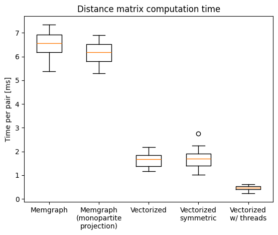

<( [Measuring the current search result ranking](../ndcg-benchmark/index.md) )

# Identity inference with graph-based hierarchical clustering

> This Python notebook shows the process of benchmarking the search result ranking for the Charles Explorer application.
> It is a part of my diploma thesis at the Faculty of Mathematics and Physics, Charles University, Prague.
>
> Find out more about the thesis in the [GitHub repository](https://github.com/barjin/master-thesis).
>
> Made by Jindřich Bär, 2024. 

To address the problems of the naïve identity inference approach, we try to add graph data to the process. 
In this post, we use the hierarchical clustering algorithm to group the potential identical graph nodes together.

In the realm of data mining and statistics, *hierarchical clustering* is an umbrella term for a set of unsupervised learning algorithms for grouping
given data points into a hierarchy of clusters. Typically, these algorithms iteratively merge the closest clusters together, until only one cluster remains.

The distance metric used for the clustering can be any metric that defines the similarity between the data points.

## Algorithm

In the case of our dataset, we can use the shortest path distance between the nodes in the graph as the distance metric.

We define the merging process as follows:

1. Start with a graph with nodes only merged based on explicit identifiers. `PUBLICATION_AUTHOR_ALL` records without an explicit identifier are represented as separate nodes.
2. Select an arbitrary unmerged node without an identifier.
    1. Using the naïve approach, we find all merge candidates for the selected node. Note that we are using the normalized name equality as the requirement for the merge.
    2. We calculate the distance matrix between the selected node and all the merge candidates.
    3. Using a hierarchical clustering algorithm, we cluster the data points based on the distance matrix. We select the cut-off distance based on the distance distribution.
3. Go to step 2 until all the non-identifier nodes are merged.

## Evaluation

To evaluate the performance of this algorithm, we first collect the largest naïve approach merge groups. 
The idea behind this is that the largest groups are the most likely to contain false positive merges.

With the following query, we create a new table `HIERARCHICAL_MERGING` that contains the normalized name, unique identifier, and publication ID for each author node.

```sql
CREATE TABLE HIERARCHICAL_MERGING AS select 
	normalize_name("PERSON_NAME") as normalized_name, -- uses the normalize_name extension
	"rank" || '-' || replace(replace(replace(lower("PERSON_NAME"),' ', '-'), '.', '-'), ',', '-') || '-' || "PUBLICATION_ID" AS "unique_id", -- creates a unique identifier for each author node
	"PUBLICATION_ID"
	from PUBLICATION_AUTHOR_ALL
WHERE LENGTH(PERSON_ID) = 0;
-- took 4010 ms 

CREATE INDEX IF NOT EXISTS i_NORMALIZED_NAME on HIERARCHICAL_MERGING("NORMALIZED_NAME");
-- took 2152 ms
```

Then, we group this table by the normalized name and select the groups with the most members.


```python
import sqlite3 
import pandas as pd

df = pd.DataFrame({
    'normalized_name': [],
    'unique_id': [],
    'publication_id': [],
})

with sqlite3.connect("explorer.db") as conn:
    cursor = conn.cursor()
    
    cursor.execute("""
SELECT *
FROM   hierarchical_merging
WHERE  normalized_name IN (SELECT normalized_name
                           FROM   (SELECT normalized_name,
                                          Count(*) AS C
                                   FROM   hierarchical_merging
                                   GROUP  BY normalized_name
                                   ORDER  BY c DESC
                                   LIMIT  10)); """
    )

    for row in cursor.fetchall():
        df.loc[len(df)] = row

df.to_csv('hierarchical_merging.csv', index=False)
```

Now that we have the 10 largest groups of naïve merges, we can evaluate the hierarchical clustering algorithm on them.

### Distance matrix calculation

We start by calculating the distance matrix of a given group.


```python
import pandas as pd

df = pd.read_csv('hierarchical_merging.csv')

ids = df[df['normalized_name'] == 'h abramowicz']['unique_id'].to_list()
```

We issue the following Cypher query to Memgraph to get the pairwise distances between the nodes in the group.

First, we evaluate this query on the first 5 ids only:


```python
import time
from utils.memgraph import execute_query

query = f"""
MATCH path=(p1: person)-[*BFS]-(p2: person)
WHERE
    p1.PERSON_ID IN $queryCandidates
        AND
    p2.PERSON_ID IN $queryCandidates
RETURN
    p1.PERSON_ID,
    p2.PERSON_ID,
    size(path) AS distance
"""

start = time.time()
records, _, _ = execute_query(query, queryCandidates=ids[0:5])
end = time.time()

print(f"Got {len(records)} records")
print(f"Query took {end - start} seconds")
```

    Got 25 records
    Query took 15.13455677032470703 seconds


While we are only retrieving distances for 25 pairs of nodes, the query takes 15 seconds to complete.
Let's explore the query execution plan


```python
execute_query(f"EXPLAIN {query}", queryCandidates=ids[0:5])
```


    ([<Record QUERY PLAN=' * Produce {p1.PERSON_ID, p2.PERSON_ID, distance}'>,
      <Record QUERY PLAN=' * ConstructNamedPath'>,
      <Record QUERY PLAN=' * Filter (p2 :person), Generic {p2}'>,
      <Record QUERY PLAN=' * BFSExpand (p1)-[anon1]-(p2)'>,
      <Record QUERY PLAN=' * Filter (p1 :person), Generic {p1}'>,
      <Record QUERY PLAN=' * ScanAll (p1)'>,
      <Record QUERY PLAN=' * Once'>],
     <neo4j._work.summary.ResultSummary at 0x7f4c58a20a30>,
     ['QUERY PLAN'])


(Technical note: the plan is to be read from the bottom to the top.)

---

We see that the query is doing a full scan on the first node matching - followed by a filter on the `PERSON_ID` property. The search for the second node is done by a BFS expansion from the first node and repeated filtering. All of this is highly inefficient.

Experimenting with the query shows us that inlining the parameter as an array literal into the query results in an much faster execution plan.


```python
start = time.time()
execute_query(query.replace("$queryCandidates", str(ids[0:5])))
end = time.time()
print(f"Query took {end - start} seconds")
```

    Query took 0.03372311592102051 seconds


```python
execute_query(f"""EXPLAIN {
    query.replace("$queryCandidates", str(ids[0:5]))
}""")
```


    ([<Record QUERY PLAN=' * Produce {p1.PERSON_ID, p2.PERSON_ID, distance}'>,
      <Record QUERY PLAN=' * ConstructNamedPath'>,
      <Record QUERY PLAN=' * STShortestPath (p1)-[anon1]-(p2)'>,
      <Record QUERY PLAN=' * ScanAllByLabelPropertyValue (p2 :person {PERSON_ID})'>,
      <Record QUERY PLAN=' * Unwind'>,
      <Record QUERY PLAN=' * ScanAllByLabelPropertyValue (p1 :person {PERSON_ID})'>,
      <Record QUERY PLAN=' * Unwind'>,
      <Record QUERY PLAN=' * Once'>],
     <neo4j._work.summary.ResultSummary at 0x7f4c58a21ba0>,
     ['QUERY PLAN'])


We see that the inlined-array version of the query causes Memgraph to utilize the index on `PERSON_ID`. The search for the second node is also done by the index lookup and the breadth-first search is replaced by the s-t shortest path algorithm.

The speedup is significant - the query now takes ~30 ms instead of 15000 ms.

We continue by calculating the distances for 100,000 pairs of nodes.


```python
BATCH_SIZE = 1000
offset = 0 

df = pd.DataFrame(columns=['p1', 'p2', 'distance'])

start = time.time()
while offset < 100_000:
    print(f"Processing {offset} / {100_000}")
    records, _, _ = execute_query(f"""{query.replace("$queryCandidates", str(ids))} SKIP {offset} limit {BATCH_SIZE}""");
    offset += BATCH_SIZE

    for record in records:
        df.loc[len(df)] = [record['p1.PERSON_ID'], record['p2.PERSON_ID'], record['distance']]
end = time.time()

print(f"Query took {end - start} seconds")

df
```

    Processing 0 / 100000
    Processing 1000 / 100000
    Processing 2000 / 100000
    Processing 3000 / 100000
    Processing 4000 / 100000
    Processing 5000 / 100000
    Processing 6000 / 100000
    Processing 7000 / 100000
    Processing 8000 / 100000
    Processing 9000 / 100000
    Processing 10000 / 100000
    Processing 11000 / 100000
    Processing 12000 / 100000
    Processing 13000 / 100000
    Processing 14000 / 100000
    Processing 15000 / 100000
    Processing 16000 / 100000
    Processing 17000 / 100000
    Processing 18000 / 100000
    Processing 19000 / 100000
    Processing 20000 / 100000
    Processing 21000 / 100000
    Processing 22000 / 100000
    Processing 23000 / 100000
    Processing 24000 / 100000
    Processing 25000 / 100000
    Processing 26000 / 100000
    Processing 27000 / 100000
    Processing 28000 / 100000
    Processing 29000 / 100000
    Processing 30000 / 100000
    Processing 31000 / 100000
    Processing 32000 / 100000
    Processing 33000 / 100000
    Processing 34000 / 100000
    Processing 35000 / 100000
    Processing 36000 / 100000
    Processing 37000 / 100000
    Processing 38000 / 100000
    Processing 39000 / 100000
    Processing 40000 / 100000
    Processing 41000 / 100000
    Processing 42000 / 100000
    Processing 43000 / 100000
    Processing 44000 / 100000
    Processing 45000 / 100000
    Processing 46000 / 100000
    Processing 47000 / 100000
    Processing 48000 / 100000
    Processing 49000 / 100000
    Processing 50000 / 100000
    Processing 51000 / 100000
    Processing 52000 / 100000
    Processing 53000 / 100000
    Processing 54000 / 100000
    Processing 55000 / 100000
    Processing 56000 / 100000
    Processing 57000 / 100000
    Processing 58000 / 100000
    Processing 59000 / 100000
    Processing 60000 / 100000
    Processing 61000 / 100000
    Processing 62000 / 100000
    Processing 63000 / 100000
    Processing 64000 / 100000
    Processing 65000 / 100000
    Processing 66000 / 100000
    Processing 67000 / 100000
    Processing 68000 / 100000
    Processing 69000 / 100000
    Processing 70000 / 100000
    Processing 71000 / 100000
    Processing 72000 / 100000
    Processing 73000 / 100000
    Processing 74000 / 100000
    Processing 75000 / 100000
    Processing 76000 / 100000
    Processing 77000 / 100000
    Processing 78000 / 100000
    Processing 79000 / 100000
    Processing 80000 / 100000
    Processing 81000 / 100000
    Processing 82000 / 100000
    Processing 83000 / 100000
    Processing 84000 / 100000
    Processing 85000 / 100000
    Processing 86000 / 100000
    Processing 87000 / 100000
    Processing 88000 / 100000
    Processing 89000 / 100000
    Processing 90000 / 100000
    Processing 91000 / 100000
    Processing 92000 / 100000
    Processing 93000 / 100000
    Processing 94000 / 100000
    Processing 95000 / 100000
    Processing 96000 / 100000
    Processing 97000 / 100000
    Processing 98000 / 100000
    Processing 99000 / 100000
    Query took 537.5532047748566 seconds


<div>
<style scoped>
    .dataframe tbody tr th:only-of-type {
        vertical-align: middle;
    }

    .dataframe tbody tr th {
        vertical-align: top;
    }

    .dataframe thead th {
        text-align: right;
    }
</style>
<table border="1" class="dataframe">
  <thead>
    <tr style="text-align: right;">
      <th></th>
      <th>p1</th>
      <th>p2</th>
      <th>distance</th>
    </tr>
  </thead>
  <tbody>
    <tr>
      <th>0</th>
      <td>6152-h-abramowicz-608329</td>
      <td>6832-h-abramowicz-608307</td>
      <td>4</td>
    </tr>
    <tr>
      <th>1</th>
      <td>6152-h-abramowicz-608329</td>
      <td>7256-h-abramowicz-608355</td>
      <td>4</td>
    </tr>
    <tr>
      <th>2</th>
      <td>6152-h-abramowicz-608329</td>
      <td>7422-h-abramowicz-608270</td>
      <td>4</td>
    </tr>
    <tr>
      <th>3</th>
      <td>6152-h-abramowicz-608329</td>
      <td>7657-h-abramowicz-608106</td>
      <td>4</td>
    </tr>
    <tr>
      <th>4</th>
      <td>6152-h-abramowicz-608329</td>
      <td>168658-h--abramowicz-526468</td>
      <td>4</td>
    </tr>
    <tr>
      <th>...</th>
      <td>...</td>
      <td>...</td>
      <td>...</td>
    </tr>
    <tr>
      <th>99995</th>
      <td>618080-h--abramowicz-488839</td>
      <td>708810-h--abramowicz-506543</td>
      <td>4</td>
    </tr>
    <tr>
      <th>99996</th>
      <td>618080-h--abramowicz-488839</td>
      <td>710032-h--abramowicz-523658</td>
      <td>4</td>
    </tr>
    <tr>
      <th>99997</th>
      <td>618080-h--abramowicz-488839</td>
      <td>710986-h--abramowicz-523451</td>
      <td>4</td>
    </tr>
    <tr>
      <th>99998</th>
      <td>618080-h--abramowicz-488839</td>
      <td>712639-h--abramowicz-522545</td>
      <td>4</td>
    </tr>
    <tr>
      <th>99999</th>
      <td>618080-h--abramowicz-488839</td>
      <td>713124-h--abramowicz-523420</td>
      <td>4</td>
    </tr>
  </tbody>
</table>
<p>100000 rows × 3 columns</p>
</div>


```python
((end-start)*1000) / 100_000
```


    5.375532047748566


The approach above with `SKIP` and `LIMIT` results in a mean time of 5.37 ms per pair of nodes. For calculating the matrix of e.g. `490000` pairs (for an external author consisting of 700 nodes), this would take around 43 minutes.

While this is a one-time operation (and the distances cannot change, as the external author nodes are always connected only to the one publication they are attributed to), it is still a significant amount of time.

### Monopartite projection

The run time of the distance matrix calculation is further increased by the
bipartitedness of the graph. During the calculation of the shortest path
distance between two person nodes, the breadth-first search algorithm is
forced to explore the intermediate publication nodes - even though they
have no possibility of being the target node. This can inflate the size of the
internal BFS queue and the number of the visited nodes.

To calculate the monopartite network projection, we can a set of SQL queries.

First, we create a table with the normalized names of the authors and their unique identifiers. The column `NORMALIZED` contains the normalized name of the author, while the column `UNIQUE_ID` contains the unique identifier of the author. The unique identifier is created by concatenating the row ID of the author with the normalized name of the author. For authors with available identifiers, the `UNIQUE_ID` column contains the identifier.
Last column `PUBLICATION_ID` contains the publication ID of the publication the author is attributed to.

```sql
CREATE TABLE PROJECTION AS
SELECT 
	normalize_name(PERSON_NAME) as NORMALIZED, 
	CASE WHEN length(PERSON_ID) > 0 then PERSON_ID ELSE (ROWID || '-' || REPLACE(normalize_name(PERSON_NAME), ' ', '-')) END AS UNIQUE_ID,
	PUBLICATION_ID
from PUBLICATION_AUTHOR_ALL;
```

For getting the edges of the new monopartite projection, we use the SQL `INNER JOIN` operation on the `PROJECTION` table with itself. We join the table on the `PUBLICATION_ID` column, which ensures that we only get the edges between the authors that are attributed to the same publication.

```sql
CREATE INDEX IF NOT EXISTS I_PROJECTION_PUBLICATIONS ON PROJECTION('PUBLICATION_ID');

SELECT X.UNIQUE_ID, Y.UNIQUE_ID 
FROM (
	SELECT UNIQUE_ID, PUBLICATION_ID FROM PROJECTION
) AS X 
INNER JOIN (
	SELECT UNIQUE_ID, PUBLICATION_ID FROM PROJECTION
) AS Y 
USING(PUBLICATION_ID)
WHERE X.UNIQUE_ID < Y.UNIQUE_ID;
```

By grouping the `PROJECTION` table by the `UNIQUE_ID` column, we can get the list of nodes in the monopartite projection.

The edge calculation is above. 

We export these new tables to CSV files and upload them to the Memgraph instance.


```python
import sqlite3 
import pandas as pd

df = pd.DataFrame({
    'unique_id': [],
    'normalized_name': [],
})

with sqlite3.connect("explorer.db") as conn:
    cursor = conn.cursor()
    
    cursor.execute("""
                  
SELECT unique_id, "min(normalized)" FROM NODES WHERE "min(normalized)" in (
SELECT name FROM (
SELECT 
	"min(normalized)" as name, 
	count(*) as c 
from nodes 
	group by "min(normalized)" 
	order by c 
	desc limit 10
));"""
    )

    for row in cursor.fetchall():
        df.loc[len(df)] = row

df.to_csv('hierarchical_merging_new_ids.csv', index=False)
```


```python
import pandas as pd

df = pd.read_csv('hierarchical_merging_new_ids.csv')

ids = df[df['normalized_name'] == 'h abramowicz']['unique_id'].to_list()
len(ids)
```


    868


Now we can repeat the experiment with the distance matrix calculation on the monopartite projection.


```python
import time 
from utils.memgraph import execute_query

BATCH_SIZE = 1000
offset = 0 

df = pd.DataFrame(columns=['p1', 'p2', 'distance'])

query = f"""
MATCH path=(p1: Person)-[*BFS]-(p2: Person)
WHERE
    p1.id IN $queryCandidates
        AND
    p2.id IN $queryCandidates
RETURN
    p1.id,
    p2.id,
    size(path) AS distance
"""

start = time.time()
while offset < 100_000:
    print(f"Processing {offset} / {100_000}")
    records, _, _ = execute_query(f"""{query.replace("$queryCandidates", str(ids))} SKIP {offset} limit {BATCH_SIZE}""");
    offset += BATCH_SIZE

    for record in records:
        df.loc[len(df)] = [record['p1.id'], record['p2.id'], record['distance']]
end = time.time()

print(f"Query took {end - start} seconds")

df
```

    Processing 0 / 100000
    Processing 1000 / 100000
    Processing 2000 / 100000
    Processing 3000 / 100000
    Processing 4000 / 100000
    Processing 5000 / 100000
    Processing 6000 / 100000
    Processing 7000 / 100000
    Processing 8000 / 100000
    Processing 9000 / 100000
    Processing 10000 / 100000
    Processing 11000 / 100000
    Processing 12000 / 100000
    Processing 13000 / 100000
    Processing 14000 / 100000
    Processing 15000 / 100000
    Processing 16000 / 100000
    Processing 17000 / 100000
    Processing 18000 / 100000
    Processing 19000 / 100000
    Processing 20000 / 100000
    Processing 21000 / 100000
    Processing 22000 / 100000
    Processing 23000 / 100000
    Processing 24000 / 100000
    Processing 25000 / 100000
    Processing 26000 / 100000
    Processing 27000 / 100000
    Processing 28000 / 100000
    Processing 29000 / 100000
    Processing 30000 / 100000
    Processing 31000 / 100000
    Processing 32000 / 100000
    Processing 33000 / 100000
    Processing 34000 / 100000
    Processing 35000 / 100000
    Processing 36000 / 100000
    Processing 37000 / 100000
    Processing 38000 / 100000
    Processing 39000 / 100000
    Processing 40000 / 100000
    Processing 41000 / 100000
    Processing 42000 / 100000
    Processing 43000 / 100000
    Processing 44000 / 100000
    Processing 45000 / 100000
    Processing 46000 / 100000
    Processing 47000 / 100000
    Processing 48000 / 100000
    Processing 49000 / 100000
    Processing 50000 / 100000
    Processing 51000 / 100000
    Processing 52000 / 100000
    Processing 53000 / 100000
    Processing 54000 / 100000
    Processing 55000 / 100000
    Processing 56000 / 100000
    Processing 57000 / 100000
    Processing 58000 / 100000
    Processing 59000 / 100000
    Processing 60000 / 100000
    Processing 61000 / 100000
    Processing 62000 / 100000
    Processing 63000 / 100000
    Processing 64000 / 100000
    Processing 65000 / 100000
    Processing 66000 / 100000
    Processing 67000 / 100000
    Processing 68000 / 100000
    Processing 69000 / 100000
    Processing 70000 / 100000
    Processing 71000 / 100000
    Processing 72000 / 100000
    Processing 73000 / 100000
    Processing 74000 / 100000
    Processing 75000 / 100000
    Processing 76000 / 100000
    Processing 77000 / 100000
    Processing 78000 / 100000
    Processing 79000 / 100000
    Processing 80000 / 100000
    Processing 81000 / 100000
    Processing 82000 / 100000
    Processing 83000 / 100000
    Processing 84000 / 100000
    Processing 85000 / 100000
    Processing 86000 / 100000
    Processing 87000 / 100000
    Processing 88000 / 100000
    Processing 89000 / 100000
    Processing 90000 / 100000
    Processing 91000 / 100000
    Processing 92000 / 100000
    Processing 93000 / 100000
    Processing 94000 / 100000
    Processing 95000 / 100000
    Processing 96000 / 100000
    Processing 97000 / 100000
    Processing 98000 / 100000
    Processing 99000 / 100000
    Query took 634.8132185935974 seconds


<div>
<style scoped>
    .dataframe tbody tr th:only-of-type {
        vertical-align: middle;
    }

    .dataframe tbody tr th {
        vertical-align: top;
    }

    .dataframe thead th {
        text-align: right;
    }
</style>
<table border="1" class="dataframe">
  <thead>
    <tr style="text-align: right;">
      <th></th>
      <th>p1</th>
      <th>p2</th>
      <th>distance</th>
    </tr>
  </thead>
  <tbody>
    <tr>
      <th>0</th>
      <td>1141499-h-abramowicz</td>
      <td>1143186-h-abramowicz</td>
      <td>2</td>
    </tr>
    <tr>
      <th>1</th>
      <td>1141499-h-abramowicz</td>
      <td>1143312-h-abramowicz</td>
      <td>2</td>
    </tr>
    <tr>
      <th>2</th>
      <td>1141499-h-abramowicz</td>
      <td>1149866-h-abramowicz</td>
      <td>2</td>
    </tr>
    <tr>
      <th>3</th>
      <td>1141499-h-abramowicz</td>
      <td>1152472-h-abramowicz</td>
      <td>2</td>
    </tr>
    <tr>
      <th>4</th>
      <td>1141499-h-abramowicz</td>
      <td>1156297-h-abramowicz</td>
      <td>2</td>
    </tr>
    <tr>
      <th>...</th>
      <td>...</td>
      <td>...</td>
      <td>...</td>
    </tr>
    <tr>
      <th>99995</th>
      <td>1309755-h-abramowicz</td>
      <td>616512-h-abramowicz</td>
      <td>2</td>
    </tr>
    <tr>
      <th>99996</th>
      <td>1309755-h-abramowicz</td>
      <td>616544-h-abramowicz</td>
      <td>2</td>
    </tr>
    <tr>
      <th>99997</th>
      <td>1309755-h-abramowicz</td>
      <td>616618-h-abramowicz</td>
      <td>2</td>
    </tr>
    <tr>
      <th>99998</th>
      <td>1309755-h-abramowicz</td>
      <td>617091-h-abramowicz</td>
      <td>2</td>
    </tr>
    <tr>
      <th>99999</th>
      <td>1309755-h-abramowicz</td>
      <td>617122-h-abramowicz</td>
      <td>2</td>
    </tr>
  </tbody>
</table>
<p>100000 rows × 3 columns</p>
</div>


```python
((end-start)*1000) / 100_000
```


    6.348132185935974


We see that the monopartite projection graph resulted in an even slower distance matrix calculation.

While the uptick in the mean time per pair is most probably just a fluctuation caused by a momentary workstation load, this also shows us that the graph shrinking does not necessarily lead to a faster calculation.

## From start-target to start-targetS

Another potential optimization is based on the way the distances between the nodes are caluculated.
During BFS, the algorithm visits growing k-hop neighborhoods of the start node until it finds the target node.

Since we are calculating the entire distance matrix (for a set of nodes), we can optimize the algorithm by calculating the distances between one start node and multiple target nodes (i.e. the entire distance matrix row) during one graph search.

While Memgraph uses a slightly modified version of the BFS algorithm for searching the shortest path between two nodes [(see the implementation)](https://github.com/memgraph/memgraph/blob/58c3902c194e80a027d141788bd1afd07def0114/src/query/plan/operator.cpp#L1569-L1572) - expanding from both the start and the target node - the algorithm still runs this process for each pair of nodes separately.
This is mostly due to the specific nature of our problem - and missing support for this "vectorized" BFS expansion in Memgraph.
While the possibility of this optimization could likely be inferred from the Cypher query (and the query planner could optimize the query accordingly), the current implementation does not support this.

To speed up the distance matrix computation, we implement our own version of the BFS algorithm in a custom C++ program. Given a CSV with the edges of the graph, the program calculates the distance matrix for a given set of nodes.

The program source code is available in the [thesis GitHub repository](https://github.com/barjin/master-thesis/tree/main/examples/distance-matrix).

Calculating the distance matrix for the same set of nodes as before, we see that the custom program is significantly faster than the Cypher query:


```python
import numpy as np
import matplotlib.pyplot as plt

measurements = [
np.array([6.11079905, 5.79937726, 6.60828484, 5.3695583 , 7.21797307,
        7.34526385, 6.58686957, 6.52861469, 7.0352216 , 6.37196232]),
 np.array([5.99003952, 5.68864305, 6.52982193, 6.82900729, 6.90560201,
        5.28412181, 5.7300009 , 6.23405562, 6.14991884, 6.49202215]),
 np.array([1.80531411, 2.19183679, 1.95612833, 1.67597087, 1.34216438,
        1.175418  , 1.6848326 , 1.2517913 , 1.51308082, 1.86346868]),
 np.array([1.53597246, 1.77544004, 2.24401417, 1.78623411, 2.75363767,
        1.34239906, 1.60528235, 1.95255756, 1.01180207, 1.17607681]),
 np.array([0.45197211, 0.32973187, 0.48522887, 0.23372822, 0.39288175,
        0.60631992, 0.53660973, 0.41615214, 0.57888239, 0.49255295])]
plt.boxplot(measurements)

plt.xticks([1, 2, 3, 4, 5], ['Memgraph', 'Memgraph\n(monopartite\nprojection)', 'Vectorized', 'Vectorized\nsymmetric', 'Vectorized\nw/ threads'])
plt.ylabel('Time per pair [ms]')
plt.title('Distance matrix computation time')
```


    Text(0.5, 1.0, 'Distance matrix computation time')


    

    


We see that calculating only the upper triangle of the distance matrix (i.e. the distances between the nodes) does not bring any significant speedup. 

While this might help with the original computation of the distance matrix (i.e. calculating the distance for each pair separately), the custom program already calculates the distances for all pairs of nodes in parallel.
For graphs where most of the target nodes are in the same depth from the start node (and we terminate the search once we find all target nodes), the speed-up is insignificant. 

Since the BFS expansion is a read-only operation, parallelization of the problem is straightforward. We can split the set of distance-matrix nodes into multiple parts and calculate the rows of the matrix in parallel threads.
This brings the expected approximately 4-fold computational speedup.
