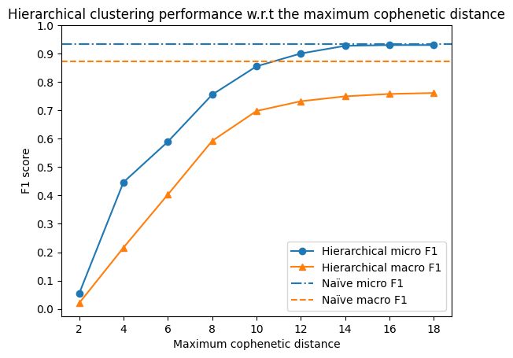

<( [Calculating distance matrices **fast**](../inference-distance-matrix/index.md) )

# Identity inference with graph-based hierarchical clustering

> This Python notebook shows the process of benchmarking the search result ranking for the Charles Explorer application.
> It is a part of my diploma thesis at the Faculty of Mathematics and Physics, Charles University, Prague.
>
> Find out more about the thesis in the [GitHub repository](https://github.com/barjin/master-thesis).
>
> Made by Jindřich Bär, 2024. 

To address the problems of the naïve identity inference approach, we try to add graph data to the process. 
In this post, we use the hierarchical clustering algorithm to group the potential identical graph nodes together.

In the realm of data mining and statistics, *hierarchical clustering* is an umbrella term for a set of unsupervised learning algorithms for grouping
given data points into a hierarchy of clusters. Typically, these algorithms iteratively merge the closest clusters together, until only one cluster remains.

The distance metric used for the clustering can be any metric that defines the similarity between the data points.


As in the case of the naïve approach (more in the [thesis](https://jindrich.bar/master-thesis/bar-social-network-analysis-in-academic-environment-2024.pdf)), we use the "labeled" dataset (of internal authors with explicit identities) to evaluate the clustering results.

We start by finding n-tuples of internal authors with the same normalized name. Those will serve as the merge candidate groups we will be calculating the distances for.

First, we create a temporary table listing all the internal authors, their identifiers and their normalized names. Note that `PUBLICATION_AUTHOR_ALL` is a relational table joining authors to their publications - i.e. a single PERSON_ID can appear multiple times in the table. This simulates the same scenario with the external authors (who are just not labeled).

The `normalize_name` function is a custom SQL function loaded from an extension ([see source](https://github.com/barjin/master-thesis/tree/main/examples/sqlite-normalize-ext)).

```sql
.load ./../master-thesis/examples/sqlite-normalize-ext/norm;

CREATE TEMP TABLE if not exists AUTHORS as 
	SELECT PUBLICATION_ID, PERSON_ID, PERSON_NAME, normalize_name(PERSON_NAME) as NORM 
from PUBLICATION_AUTHOR_ALL where EXTERNAL = 0;
```

Note that due to the high computational complexity of the clustering algorithm, we evaluate the algorithm on a subset of the data. We randomly select 500 authors from the dataset. 
Additionally, we only want to consider relations concerning publications with more than one author. Note that for publications of external authors, there is always (at least) one internal author.
Including single-author publications in our benchmark might skew the results (the graph would be disconnected and the merging would not provide the expected results).

For this reason, we now delete all the records about one-author publications from the dataset.

```sql
DELETE FROM AUTHORS WHERE PUBLICATION_ID IN (
    SELECT PUBLICATION_ID FROM AUTHORS GROUP BY PUBLICATION_ID HAVING COUNT(*) = 1
);
```

The average group size in the subset is very close to the average group size in the whole dataset, so we can proceed with the clustering. We run the following SQL query and store the results in a csv file.

```sql
    SELECT PERSON_ID || '-' || PUBLICATION_ID, NORM
    FROM AUTHORS 
    WHERE NORM IN (
        SELECT NORM FROM AUTHORS GROUP BY NORM ORDER BY RANDOM() LIMIT 500
    );
```

To ensure that this subset adequately represents the dataset, we compare the average size of the merge candidate groups in the subset and the whole (labeled) dataset.

```sql
SELECT AVG(CNT) FROM (
    SELECT COUNT(*) as CNT FROM AUTHORS GROUP BY NORM
);  
-- Average normalized name group size in the whole dataset: 15.5231
```

Note that to fully simulate the external authors with the internal ones (with all the implications this has in the graph structure), we need to split each internal author into $n$ nodes, where $n$ is the number of their publications. This is done with the following SQL query generating the list of the edges in the graph.

```sql
CREATE TABLE EDGES AS
SELECT PUBLICATION_ID, PERSON_ID from authors
	UNION
SELECT PUBLICATION_ID, PERSON_ID || '-' || PUBLICATION_ID FROM AUTHORS;
```


```python
import pandas as pd

naive_merging = pd.read_csv('./merge-candidates.csv', header=None)
## We calculate the mean size of the merge groups to ensure that the selection represents the dataset
naive_merging.groupby(1).count().mean()
```


    0    15.256
    dtype: float64


The mean group size seems close enough to the one of the whole dataset, so we can proceed with the clustering.

We now process the data into a format suitable for the distance matrix computation. These are new-line separated lists of `PERSON_ID` for each normalized name group. The last entry on each line is the normalized name (name of the output CSV file with the distance matrix).


```python
with open('./data/merge-groups.csv', 'w') as f:
    for norm in naive_merging[1].unique():
        if(naive_merging[naive_merging[1] == norm].shape[0] > 1): ## we only have to merge the nodes that have more than one candidate - for unique nodes, the merge is trivial
            f.write(",".join(naive_merging[naive_merging[1] == norm][0].to_list()) + ',' + "./out/" + norm.replace(' ', '_') + '.csv' + '\n')
```

Using the distance matrix computation tool we descibed in the previous post, we can now calculate the distance matrices on the authors belonging to the same normalized name group.

We store the results as CSV files in the `distance-matrices` directory.

With the distance matrices computed, we can now proceed to the hierarchical clustering algorithm.


```python
import glob
import scipy.spatial.distance as ssd
import scipy.cluster.hierarchy as sch
import numpy as np

predictions_per_distance = {}

m = None

def get_order(matrix: np.array):
    """ 
    Given a (shuffled) distance matrix n x n, return an array of true indexes of the 
    rows in the correct order (so the diagonal is 0).
    """

    out = []

    for col in range(matrix.shape[1]):
        out.append(np.argmin(matrix[:, col]))

    return out

def predict(distance_matrix_file, max_cophenetic_distance=14):
    # Load the distance matrix
    m = pd.read_csv(distance_matrix_file, header=None)

    # The first column contains the row identifiers
    m.set_index(0, inplace=True)

    # The last column is empty (due to the trailing comma in the CSV file) 
    m.drop(columns=[m.columns[-1]], inplace=True)

    # Reorder the columns to match the row order
    # The broken up order is because of the multi-threaded nature of the distance matrix calculation.
    m = m.iloc[get_order(m.to_numpy())]

    # Perform hierarchical clustering
    Y = sch.fcluster(
        sch.linkage(ssd.squareform(m, checks=False), method='complete'),
        max_cophenetic_distance,
        criterion='distance'
    )

    # Get the predicted IDs (minimums for the clusters)
    y_pred = [m.index[np.argmax(Y==c)] for c in Y]
    
    # Get the true IDs
    true_ids = np.array([id.split('-')[0] for id in m.index])
    y_true = [m.index[np.argmax(true_ids==c)] for c in true_ids]

    # Return the results
    return zip(y_true, y_pred)

for d in range(2, 20, 2):
    predictions = []
    for matrix_file in glob.glob('./data/distance-matrices/*.csv'):
        predictions.extend(predict(matrix_file, max_cophenetic_distance=d))
    predictions_per_distance[d] = predictions
```

Note that to compare the performance of the hierarchical clustering algorithm with the naïve approach, we use the same evaluation metric - the F1 score.

However, to correctly compare both methods, we need to compare the results of both methods **on the same dataset**. 
Since we calculated the hierarchical merging on the subset of the data, we need to calculate the naïve merging on the same subset:


```python
import pandas as pd

naive_merging = pd.read_csv('./merge-candidates.csv', header=None)
## We calculate the mean size of the merge groups to ensure that the selection represents the dataset
naive_merging.columns = ['id', 'norm']

naive_merging['true_id'] = naive_merging['id'].apply(lambda x: x.split('-')[0])
for norm in naive_merging['norm'].unique():
    naive_merging.loc[naive_merging['norm'] == norm, 'y_pred'] = naive_merging[naive_merging['norm'] == norm]['id'].min()

for true_id in naive_merging['true_id'].unique():
    naive_merging.loc[naive_merging['true_id'] == true_id, 'y_true'] = naive_merging[naive_merging['true_id'] == true_id]['id'].min()
```

Now that we have both the hierarchical clustering and the naïve merging results, we can evaluate the F1 score for both methods.


```python
import pandas as pd
import sklearn.metrics as skm
import numpy as np
import matplotlib.pyplot as plt

micros = []
macros = []

for predictions in predictions_per_distance.values():
    results = pd.DataFrame(predictions)
    results
    results.columns = ['y_true', 'y_pred']
    results['y_pred'] = results['y_pred'].astype(str)
    results['y_true'] = results['y_true'].astype(str)

    macro_f1_score = skm.f1_score(results['y_true'], results['y_pred'], average='macro')
    micro_f1_score = skm.f1_score(results['y_true'], results['y_pred'], average='micro')

    micros.append(micro_f1_score)
    macros.append(macro_f1_score)

plt.plot(range(2, 20, 2), micros, label='Micro-averaged F1 score', marker='o')
plt.plot(range(2, 20, 2), macros, label='Macro-averaged F1 score', marker='^')

plt.xlabel('Maximum cophenetic distance')
plt.ylabel('F1 score')
plt.yticks(np.arange(0, 1.1, 0.1))

plt.axhline(y=skm.f1_score(naive_merging['y_true'], naive_merging['y_pred'], average='micro'), color='tab:blue', linestyle='-.')
plt.axhline(y=skm.f1_score(naive_merging['y_true'], naive_merging['y_pred'], average='macro'), color='tab:orange', linestyle='--')

plt.legend(['Hierarchical micro F1', 'Hierarchical macro F1', 'Naïve micro F1', 'Naïve macro F1'])

plt.title('Hierarchical clustering performance w.r.t the maximum cophenetic distance')
plt.show()
```


    

    


We see that the performance of the hierarchical clustering algorithm is dominated by the naïve approach, regardless the parameters.

Unsurprisingly, the both methods perform more similar with the increasing cutoff cophenetic distance. 
This is because the naïve approach is essentially a special case of the hierarchical clustering algorithm with a fixed (infinite) cutoff distance - merging all the nodes in one cluster.

Note that the macro F1 score for hierarchical merging continues to grow with the increasing cutoff distance, meeting the performance of the naïve approach at 1000.
This is because the distance matrix computation tool denotes "infinite" distance (e.g. between two nodes in two disconnected components of the graph) as `1000`.

Read more details about this experiment in the [thesis](https://jindrich.bar/master-thesis/bar-social-network-analysis-in-academic-environment-2024.pdf).
