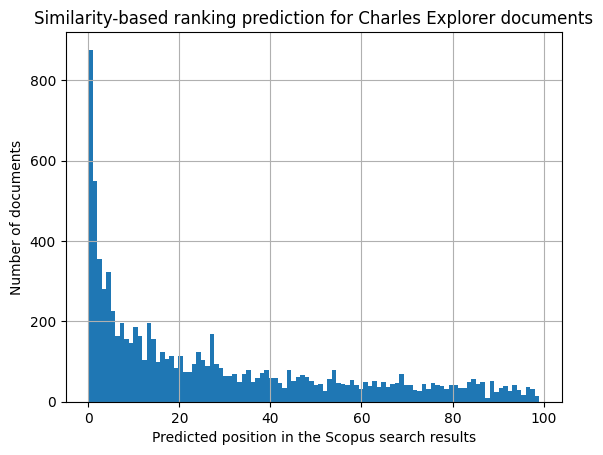
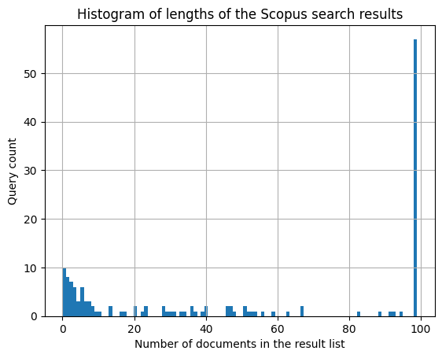

<( [Collecting the gold-standard data for benchmarking](../collecting-data/index.md) )

# Measuring the current search result ranking

> This Python notebook shows the process of benchmarking the search result ranking for the Charles Explorer application.
> It is a part of my diploma thesis at the Faculty of Mathematics and Physics, Charles University, Prague.
>
> Find out more about the thesis in the [GitHub repository](https://github.com/barjin/master-thesis).
>
> Made by Jindřich Bär, 2024. 

In the previous posts, we have established a methodology for benchmarking the different search result ranking algorithms. We have also collected the relevance scores for the benchmark, since the Charles Explorer application does not provide enough usage data to use for the benchmarking yet. 

In this post, we will measure the current search result ranking of the Charles Explorer application to establish the baseline for the benchmarking.

We start by comparing the results from both search engines (Charles Explorer and Elsevier Scopus). 


```python
import pandas as pd

queries = pd.read_csv('./best_queries.csv')
scopus = pd.read_csv('./scopus_results.csv')
explorer = pd.read_csv('./filtered_search_results.csv')

original_queries = set(queries['0'].to_list())
scopus_queries = set(scopus['query'].unique())
print(f"Scopus missing queries: {len(original_queries.difference(scopus_queries))}")
```

    Scopus missing queries: 25


For 25 queries out of the original query set of 174 queries, Scopus does not return any results. We will exclude these queries from the benchmarking.

We proceed by calculating the prceision, recall and F1 score for the search results of the Charles Explorer application - considering the Scopus search results as the ground truth.


```python
from utils.calc.precision_recall import get_precision, get_recall

queries = scopus['query'].unique()

precision = pd.Series(queries).map(
    lambda query: get_precision(
        explorer[explorer['query'] == query]['name'].to_list(), 
        scopus[scopus['query'] == query]['title'].to_list(), 
        lambda x: x.lower()
    )
)

recall = pd.Series(queries).map(
    lambda query: get_recall(
        explorer[explorer['query'] == query]['name'].to_list(), 
        scopus[scopus['query'] == query]['title'].to_list(), 
        lambda x: x.lower()
    )
)

f1 = 2 * (precision * recall) / (precision + recall)


metrics = pd.DataFrame({
    'query': queries,
    'precision': precision,
    'recall': recall,
    'f1': f1
})

metrics
```


<div>
<style scoped>
    .dataframe tbody tr th:only-of-type {
        vertical-align: middle;
    }

    .dataframe tbody tr th {
        vertical-align: top;
    }

    .dataframe thead th {
        text-align: right;
    }
</style>
<table border="1" class="dataframe">
  <thead>
    <tr style="text-align: right;">
      <th></th>
      <th>query</th>
      <th>precision</th>
      <th>recall</th>
      <th>f1</th>
    </tr>
  </thead>
  <tbody>
    <tr>
      <th>0</th>
      <td>physics</td>
      <td>0.043011</td>
      <td>0.040000</td>
      <td>0.041451</td>
    </tr>
    <tr>
      <th>1</th>
      <td>bolus</td>
      <td>0.125000</td>
      <td>0.121212</td>
      <td>0.123077</td>
    </tr>
    <tr>
      <th>2</th>
      <td>Plavix</td>
      <td>0.000000</td>
      <td>0.000000</td>
      <td>NaN</td>
    </tr>
    <tr>
      <th>3</th>
      <td>draft</td>
      <td>0.010870</td>
      <td>0.010753</td>
      <td>0.010811</td>
    </tr>
    <tr>
      <th>4</th>
      <td>block</td>
      <td>0.144330</td>
      <td>0.141414</td>
      <td>0.142857</td>
    </tr>
    <tr>
      <th>...</th>
      <td>...</td>
      <td>...</td>
      <td>...</td>
      <td>...</td>
    </tr>
    <tr>
      <th>144</th>
      <td>metaphysics</td>
      <td>0.020833</td>
      <td>0.037736</td>
      <td>0.026846</td>
    </tr>
    <tr>
      <th>145</th>
      <td>angiogenesis inhibitor</td>
      <td>0.187500</td>
      <td>0.044118</td>
      <td>0.071429</td>
    </tr>
    <tr>
      <th>146</th>
      <td>sports medicine</td>
      <td>0.109589</td>
      <td>0.163265</td>
      <td>0.131148</td>
    </tr>
    <tr>
      <th>147</th>
      <td>clinical neurology</td>
      <td>0.088889</td>
      <td>0.666667</td>
      <td>0.156863</td>
    </tr>
    <tr>
      <th>148</th>
      <td>specific</td>
      <td>0.000000</td>
      <td>0.000000</td>
      <td>NaN</td>
    </tr>
  </tbody>
</table>
<p>149 rows × 4 columns</p>
</div>


```python
metrics['f1'].describe()
```


    count    114.000000
    mean       0.208727
    std        0.211699
    min        0.010101
    25%        0.074786
    50%        0.137028
    75%        0.265263
    max        1.000000
    Name: f1, dtype: float64


These calculations show us that the mean `f1` score over all available queries is `0.21`. This shows that the current Charles Explorer search results differ quite a lot from the Scopus search results. This can be caused by mutiple reasons - either the publications are not present in the Scopus database, or the queries are not specific enough - and the search results are returning partially disjoint sets of publications.

This is an issue that cannot be solved by simply re-ranking the Charles Explorer search results. Changing the ordering of the search results will not help if the search results themselves are not relevant. Moreover, this also limits our ability to use the Scopus search results ranking as the proxy for the relevance feedback.

We are already trying to mitigate the issue of the broad queries by evaluating the benchmark on a larger-than-usual sets of results. By collecting data for the top `100` search results (Charles Explorer only shows the first 30 results by default), we could see if the missing publications are just ranked lower or if they are not present at all.

Since this thesis is focused on the search result **ranking** algorithms, we will proceed with the benchmarking as planned.
However, to improve the relevance score assignment, we try adding a *similarity search step*. 
Currently, we are only matching the Charles Explorer search results with the Scopus search results by the publication title (case-insensitive). 
This matching criterion is prone to even the slightest variations in the publication titles, which can lead to false negatives.

## Infering the relevance with similarity search

In the proposed *similarity search step*, we use the similarity of LLM (Large Language Model) embeddings to match the publication titles. This should help us to relate the publications missing from the Scopus search results to the ones present there and assign them a relevance score.

The *similarity search step* works as follows:

1. By the means of a LLM embedding model, we calculate the embeddings for the publication titles of the Elsevier Scopus search results. We store these embeddings in a vector database.
3. For each publication title in the Charles Explorer search results, we calculate its embedding. In the database, we search for the nearest embedding among Scopus search results embeddings. Futhermore, we require the retrieved document to be a result of the same query (in Elsevier Scopus) as the Charles Explorer search result.
4. We calculate original document's relevance from the retrieved document's attributes - e.g. its position in Scopus search.

> The LLM embeddings are vector representations of the publication titles. While those can be arbitrary vectors, they are usually optimized to capture the **semantic meaning** of the text. This means that texts with similar meanings should have similar embeddings - i.e. the (cosine) similarity of the embedding vectors should be high.

---

For the purpose of this thesis, we are embedding the documents using the `all-MiniLM-L6-v2` sentence-transformer model. This model is a general-purpose English embedding model designed for running on consumer-grade hardware. Due to its small size and competitive performance, it's often used for the real-time use-cases, like semantic search or RAG (Retrieval-Augmented Generation).

https://www.sbert.net/docs/sentence_transformer/pretrained_models.html


```python
from utils.llm.get_vector_db import vectorstore, embedder
import time
import warnings

warnings.filterwarnings("ignore")

KNN = 1

def get_similarity_position(records: list[str], query: str):
    embedding_start = time.time()
    vectors = embedder.embed_documents(records)
    embedding_end = time.time()

    results = []

    for vector in vectors:
        vector_db_start = time.time()
        result = vectorstore.similarity_search_by_vector(vector, KNN, filter={'query': query})
        vector_db_end = time.time()

        if(len(result) == 0):
            results.append(None)
        else:
            results.append({
                'ranking': result[0].metadata.get('ranking'),
                'embedding_duration': (embedding_end - embedding_start) / len(records),
                'vector_db_roundtrip': vector_db_end - vector_db_start
            })

    return results


def get_positions():
    new_df = pd.DataFrame()
    done=0
    total=len(explorer)

    for query in explorer['query'].unique():
        records = explorer[explorer['query'] == query]
        records.reset_index(inplace=True)
        similarities = get_similarity_position(records['name'].to_list(), query)
        records['ranking'] = [similarity['ranking'] if similarity is not None else None for similarity in similarities]
        records['embedding_duration'] = [similarity['embedding_duration'] if similarity is not None else None for similarity in similarities]
        records['vector_db_roundtrip'] = [similarity['vector_db_roundtrip'] if similarity is not None else None for similarity in similarities]

        new_df = pd.concat([new_df, records])

        done += len(records)
        print(f"Done {done} out of {total}")

    return new_df

get_positions().drop(columns=['index']).to_csv('./similarity_ranking.csv', index=False)
```

    Done 64 out of 9269
    Done 130 out of 9269
    Done 230 out of 9269
    Done 269 out of 9269
    Done 341 out of 9269
    Done 441 out of 9269
    Done 442 out of 9269
    Done 487 out of 9269
    Done 587 out of 9269
    Done 596 out of 9269
    Done 597 out of 9269
    Done 613 out of 9269
    Done 638 out of 9269
    Done 723 out of 9269
    Done 823 out of 9269
    Done 923 out of 9269
    Done 924 out of 9269
    Done 927 out of 9269
    Done 929 out of 9269
    Done 930 out of 9269
    Done 1030 out of 9269
    Done 1031 out of 9269
    Done 1039 out of 9269
    Done 1139 out of 9269
    Done 1143 out of 9269
    Done 1156 out of 9269
    Done 1161 out of 9269
    Done 1203 out of 9269
    Done 1204 out of 9269
    Done 1205 out of 9269
    Done 1305 out of 9269
    Done 1307 out of 9269
    Done 1308 out of 9269
    Done 1408 out of 9269
    Done 1508 out of 9269
    Done 1521 out of 9269
    Done 1542 out of 9269
    Done 1587 out of 9269
    Done 1687 out of 9269
    Done 1734 out of 9269
    Done 1735 out of 9269
    Done 1736 out of 9269
    Done 1836 out of 9269
    Done 1879 out of 9269
    Done 1979 out of 9269
    Done 1981 out of 9269
    Done 1983 out of 9269
    Done 2083 out of 9269
    Done 2085 out of 9269
    Done 2104 out of 9269
    Done 2204 out of 9269
    Done 2253 out of 9269
    Done 2353 out of 9269
    Done 2365 out of 9269
    Done 2367 out of 9269
    Done 2418 out of 9269
    Done 2518 out of 9269
    Done 2519 out of 9269
    Done 2545 out of 9269
    Done 2645 out of 9269
    Done 2648 out of 9269
    Done 2748 out of 9269
    Done 2773 out of 9269
    Done 2873 out of 9269
    Done 2891 out of 9269
    Done 2991 out of 9269
    Done 3091 out of 9269
    Done 3105 out of 9269
    Done 3109 out of 9269
    Done 3209 out of 9269
    Done 3309 out of 9269
    Done 3311 out of 9269
    Done 3325 out of 9269
    Done 3336 out of 9269
    Done 3338 out of 9269
    Done 3429 out of 9269
    Done 3529 out of 9269
    Done 3531 out of 9269
    Done 3631 out of 9269
    Done 3731 out of 9269
    Done 3831 out of 9269
    Done 3931 out of 9269
    Done 4016 out of 9269
    Done 4048 out of 9269
    Done 4148 out of 9269
    Done 4149 out of 9269
    Done 4249 out of 9269
    Done 4309 out of 9269
    Done 4310 out of 9269
    Done 4410 out of 9269
    Done 4510 out of 9269
    Done 4546 out of 9269
    Done 4587 out of 9269
    Done 4588 out of 9269
    Done 4589 out of 9269
    Done 4689 out of 9269
    Done 4691 out of 9269
    Done 4786 out of 9269
    Done 4820 out of 9269
    Done 4831 out of 9269
    Done 4835 out of 9269
    Done 4935 out of 9269
    Done 4993 out of 9269
    Done 5093 out of 9269
    Done 5131 out of 9269
    Done 5231 out of 9269
    Done 5239 out of 9269
    Done 5339 out of 9269
    Done 5439 out of 9269
    Done 5539 out of 9269
    Done 5566 out of 9269
    Done 5580 out of 9269
    Done 5673 out of 9269
    Done 5689 out of 9269
    Done 5694 out of 9269
    Done 5755 out of 9269
    Done 5855 out of 9269
    Done 5881 out of 9269
    Done 5981 out of 9269
    Done 6069 out of 9269
    Done 6169 out of 9269
    Done 6174 out of 9269
    Done 6192 out of 9269
    Done 6292 out of 9269
    Done 6293 out of 9269
    Done 6393 out of 9269
    Done 6453 out of 9269
    Done 6482 out of 9269
    Done 6582 out of 9269
    Done 6583 out of 9269
    Done 6683 out of 9269
    Done 6692 out of 9269
    Done 6783 out of 9269
    Done 6827 out of 9269
    Done 6927 out of 9269
    Done 7027 out of 9269
    Done 7097 out of 9269
    Done 7179 out of 9269
    Done 7203 out of 9269
    Done 7303 out of 9269
    Done 7403 out of 9269
    Done 7503 out of 9269
    Done 7603 out of 9269
    Done 7690 out of 9269
    Done 7712 out of 9269
    Done 7812 out of 9269
    Done 7813 out of 9269
    Done 7833 out of 9269
    Done 7839 out of 9269
    Done 7840 out of 9269
    Done 7856 out of 9269
    Done 7860 out of 9269
    Done 7915 out of 9269
    Done 7920 out of 9269
    Done 7935 out of 9269
    Done 8035 out of 9269
    Done 8100 out of 9269
    Done 8200 out of 9269
    Done 8201 out of 9269
    Done 8301 out of 9269
    Done 8401 out of 9269
    Done 8501 out of 9269
    Done 8601 out of 9269
    Done 8701 out of 9269
    Done 8801 out of 9269
    Done 8803 out of 9269
    Done 8805 out of 9269
    Done 8874 out of 9269
    Done 8909 out of 9269
    Done 8985 out of 9269
    Done 8998 out of 9269
    Done 9098 out of 9269
    Done 9169 out of 9269
    Done 9269 out of 9269


This expands the table with the Charles Explorer search results with the rankings of the most similar publications from the Scopus database for the given queries.

As a reminder - we are trying to use these values as a proxy for the relevance of the search results. In a way, this replaces a manual relevance score assignment, which would require us to conduct a user survey to get the relevance scores for the search results.

We can now plot the distribution of the positions of the most similar publications in the Scopus search results for the Charles Explorer search results. This will help us to see whether the similarity search step helps with the missing publications problem.


```python
import pandas as pd
import matplotlib.pyplot as plt

df = pd.read_csv('./similarity_ranking.csv')
df.rename(columns={'ranking': 'similarity_scopus_ranking'}, inplace=True)
c = df['similarity_scopus_ranking'].hist(bins=100)
c.set_title('Similarity-based ranking prediction for Charles Explorer documents')
c.set_xlabel('Predicted position in the Scopus search results')
c.set_ylabel('Number of documents')

plt.show()
```


    

    


While the distribution of the predicted rankings might seem skewed, this does not pose a serious problem to our benchmark.

Firstly, we are not trying to predict the exact ranking of the search results, but rather to assign a relevance score to each search result. The peak of the distribution is at the top of the rankings, which simulates the human behaviour of having clearer opinions about the few top search results.

Secondly, the left-skewed distribution might be caused by non-uniform lengths of the search result lists. Since for some of the queries, Scopus returns only a few relevant search results (100 is only the maximum limit), the resulting predicted rankings will be skewed towards the top of the list for these queries.


```python
h = scopus.groupby('query')['ranking'].max().hist(bins=100)

h.set_title('Histogram of lengths of the Scopus search results')
h.set_xlabel('Number of documents in the result list')
h.set_ylabel('Query count')
```


    Text(0, 0.5, 'Query count')


    

    


We now set the target value for the search ranking benchmark. We add the original positions of the search results as a separate column.


```python
rankings = pd.DataFrame()

for query in df['query'].unique():
    x = df[df['query'] == query].reset_index()
    x['charles_explorer_ranking'] = x.index
    rankings = pd.concat([
        rankings,
        x
    ])

rankings.drop(columns=['index'], inplace=True)
rankings.reset_index(inplace=True)
rankings.drop(columns=['index'], inplace=True)

rankings.rename(columns={'ranking': 'scopus_similarity_ranking'}, inplace=True)

rankings.to_csv('./rankings.csv', index=False)
rankings
```


<div>
<style scoped>
    .dataframe tbody tr th:only-of-type {
        vertical-align: middle;
    }

    .dataframe tbody tr th {
        vertical-align: top;
    }

    .dataframe thead th {
        text-align: right;
    }
</style>
<table border="1" class="dataframe">
  <thead>
    <tr style="text-align: right;">
      <th></th>
      <th>id</th>
      <th>year</th>
      <th>name</th>
      <th>faculty</th>
      <th>faculty_name</th>
      <th>query</th>
      <th>similarity_scopus_ranking</th>
      <th>embedding_duration</th>
      <th>vector_db_roundtrip</th>
      <th>charles_explorer_ranking</th>
    </tr>
  </thead>
  <tbody>
    <tr>
      <th>0</th>
      <td>491147</td>
      <td>2014.0</td>
      <td>Lexical semantic conversions in a valency lexicon</td>
      <td>11320</td>
      <td>Faculty of Mathematics and Physics</td>
      <td>lexical semantics</td>
      <td>0.0</td>
      <td>0.021093</td>
      <td>0.019749</td>
      <td>0</td>
    </tr>
    <tr>
      <th>1</th>
      <td>592464</td>
      <td>2020.0</td>
      <td>Dirk Geeraerts:Theories of Lexical Semantics</td>
      <td>11210</td>
      <td>Faculty of Arts</td>
      <td>lexical semantics</td>
      <td>0.0</td>
      <td>0.021093</td>
      <td>0.019631</td>
      <td>1</td>
    </tr>
    <tr>
      <th>2</th>
      <td>594640</td>
      <td>NaN</td>
      <td>DIACR-Ita @ EVALITA2020: Overview of the EVALI...</td>
      <td>-1</td>
      <td>Unknown faculty</td>
      <td>lexical semantics</td>
      <td>0.0</td>
      <td>0.021093</td>
      <td>0.015370</td>
      <td>2</td>
    </tr>
    <tr>
      <th>3</th>
      <td>588808</td>
      <td>2020.0</td>
      <td>Dual semantics of intransitive verbs: lexical ...</td>
      <td>11210</td>
      <td>Faculty of Arts</td>
      <td>lexical semantics</td>
      <td>5.0</td>
      <td>0.021093</td>
      <td>0.015556</td>
      <td>3</td>
    </tr>
    <tr>
      <th>4</th>
      <td>268937</td>
      <td>2000.0</td>
      <td>Manfred Stede: Lexical Semantics and Knowledge...</td>
      <td>11320</td>
      <td>Faculty of Mathematics and Physics</td>
      <td>lexical semantics</td>
      <td>2.0</td>
      <td>0.021093</td>
      <td>0.015275</td>
      <td>4</td>
    </tr>
    <tr>
      <th>...</th>
      <td>...</td>
      <td>...</td>
      <td>...</td>
      <td>...</td>
      <td>...</td>
      <td>...</td>
      <td>...</td>
      <td>...</td>
      <td>...</td>
      <td>...</td>
    </tr>
    <tr>
      <th>9264</th>
      <td>73261</td>
      <td>2005.0</td>
      <td>Modern X-ray imaging techniques and their use ...</td>
      <td>-1</td>
      <td>Unknown faculty</td>
      <td>biology</td>
      <td>94.0</td>
      <td>0.019262</td>
      <td>0.016730</td>
      <td>95</td>
    </tr>
    <tr>
      <th>9265</th>
      <td>31897</td>
      <td>2003.0</td>
      <td>Teaching tasks for biology education</td>
      <td>11310</td>
      <td>Faculty of Science</td>
      <td>biology</td>
      <td>18.0</td>
      <td>0.019262</td>
      <td>0.013611</td>
      <td>96</td>
    </tr>
    <tr>
      <th>9266</th>
      <td>566168</td>
      <td>2019.0</td>
      <td>Hands-on activities in biology: students' opinion</td>
      <td>11310</td>
      <td>Faculty of Science</td>
      <td>biology</td>
      <td>18.0</td>
      <td>0.019262</td>
      <td>0.012192</td>
      <td>97</td>
    </tr>
    <tr>
      <th>9267</th>
      <td>279719</td>
      <td>2013.0</td>
      <td>One of the Overlooked Themes in High School Pr...</td>
      <td>11310</td>
      <td>Faculty of Science</td>
      <td>biology</td>
      <td>1.0</td>
      <td>0.019262</td>
      <td>0.013341</td>
      <td>98</td>
    </tr>
    <tr>
      <th>9268</th>
      <td>551485</td>
      <td>2018.0</td>
      <td>Evolutionary biology : In the history, today a...</td>
      <td>11310</td>
      <td>Faculty of Science</td>
      <td>biology</td>
      <td>52.0</td>
      <td>0.019262</td>
      <td>0.013132</td>
      <td>99</td>
    </tr>
  </tbody>
</table>
<p>9269 rows × 10 columns</p>
</div>


Using the original ranking positions and the predicted ranking positions as the source for the relevance feedback, we can calculate the nDCG (Normalized Discounted Cumulative Gain) score for the search result ranking.

The nDCG score is a measure of the ranking quality of the search results. It is calculated as the ratio of the DCG (Discounted Cumulative Gain) score to the IDCG (Ideal Discounted Cumulative Gain) score. The DCG score is calculated as the sum of the relevance scores of the search results, discounted by their position in the ranking. The IDCG score is the DCG score of the ideal ranking of the search results.

To transform the predicted Scopus rankings into relevance feedback, we introduce a new function $rel_q(d)$. For a given query $q$, the document $d$ is considered to have relevance of $rel_q(d)$, which is inverse proportional to its predicted ranking. This is necessary for the `nDCG` score calculation, which requires more relevant documents to have *higher* relevance scores.

The inverse proportionality is achieved by the following formula:

$$
rel_q(d) = \frac{a}{\text{rank}_q(d) + 1}
$$

where $a$ is a constant that scales the relevance scores and can help achieve better numerical stability of the `nDCG` score. For the purpose of this thesis, we set $a = 5$.
 The `+1` in the denominator is necessary to avoid division by zero, as our rankings are 0-based.

While it would be possible to achieve the ranking - relevance transformation via e.g. subtracting the predicted ranking from the total number of search results, our proposed method with $rel_q(d)$ introduces a non-linear transformation of the predicted rankings. This differentiates better between the search results that are ranked higher in the Scopus search results. This is in line with the human behaviour of having clearer opinions about the top search results. 

<!-- @ARTICLE{9357332,

  author={Su, Zhan and Lin, Zuyi and Ai, Jun and Li, Hui},

  journal={IEEE Access}, 

  title={Rating Prediction in Recommender Systems Based on User Behavior Probability and Complex Network Modeling}, 

  year={2021},

  volume={9},

  number={},

  pages={30739-30749},

  keywords={Motion pictures;Recommender systems;Predictive models;Prediction algorithms;Complex networks;Probability;Correlation;Complex network modeling;recommender systems;degree centrality;link prediction;user behavior probability},

  doi={10.1109/ACCESS.2021.3060016}} -->


```python
from typing import List
import numpy as np

def get_ndcg(gold_rankings: List[int]):
    dcg = 0
    for i, result in enumerate(gold_rankings):
        relevance = 5 / (result + 1)

        dcg += relevance / np.log2(i + 2)
    return dcg
```


```python
scores = pd.DataFrame()

queries = []
dcgs = []
best_ndcgs = []
for query in rankings['query'].unique():
    queries.append(query)
    dcgs.append(get_ndcg(rankings[rankings['query'] == query]['similarity_scopus_ranking'].to_list()))
    best_ndcgs.append(get_ndcg(rankings[rankings['query'] == query].sort_values('similarity_scopus_ranking')['similarity_scopus_ranking'].to_list()))

scores['query'] = queries
scores['dcg'] = dcgs
scores['idcg'] = best_ndcgs
scores['ndcg'] = scores['dcg'] / scores['idcg']

scores
```


<div>
<style scoped>
    .dataframe tbody tr th:only-of-type {
        vertical-align: middle;
    }

    .dataframe tbody tr th {
        vertical-align: top;
    }

    .dataframe thead th {
        text-align: right;
    }
</style>
<table border="1" class="dataframe">
  <thead>
    <tr style="text-align: right;">
      <th></th>
      <th>query</th>
      <th>dcg</th>
      <th>idcg</th>
      <th>ndcg</th>
    </tr>
  </thead>
  <tbody>
    <tr>
      <th>0</th>
      <td>lexical semantics</td>
      <td>29.482590</td>
      <td>33.308123</td>
      <td>0.885147</td>
    </tr>
    <tr>
      <th>1</th>
      <td>booster</td>
      <td>11.771938</td>
      <td>17.401799</td>
      <td>0.676478</td>
    </tr>
    <tr>
      <th>2</th>
      <td>logic</td>
      <td>4.557156</td>
      <td>11.233671</td>
      <td>0.405669</td>
    </tr>
    <tr>
      <th>3</th>
      <td>gabapentin</td>
      <td>18.529698</td>
      <td>21.165926</td>
      <td>0.875449</td>
    </tr>
    <tr>
      <th>4</th>
      <td>thalidomide</td>
      <td>13.151393</td>
      <td>20.222288</td>
      <td>0.650341</td>
    </tr>
    <tr>
      <th>...</th>
      <td>...</td>
      <td>...</td>
      <td>...</td>
      <td>...</td>
    </tr>
    <tr>
      <th>169</th>
      <td>sports medicine</td>
      <td>27.963706</td>
      <td>33.238549</td>
      <td>0.841303</td>
    </tr>
    <tr>
      <th>170</th>
      <td>dendrology</td>
      <td>NaN</td>
      <td>NaN</td>
      <td>NaN</td>
    </tr>
    <tr>
      <th>171</th>
      <td>alienism</td>
      <td>88.309044</td>
      <td>93.423651</td>
      <td>0.945254</td>
    </tr>
    <tr>
      <th>172</th>
      <td>hedonism</td>
      <td>42.712391</td>
      <td>47.876866</td>
      <td>0.892130</td>
    </tr>
    <tr>
      <th>173</th>
      <td>biology</td>
      <td>18.064385</td>
      <td>31.570575</td>
      <td>0.572191</td>
    </tr>
  </tbody>
</table>
<p>174 rows × 4 columns</p>
</div>


```python
scores.describe()
```


<div>
<style scoped>
    .dataframe tbody tr th:only-of-type {
        vertical-align: middle;
    }

    .dataframe tbody tr th {
        vertical-align: top;
    }

    .dataframe thead th {
        text-align: right;
    }
</style>
<table border="1" class="dataframe">
  <thead>
    <tr style="text-align: right;">
      <th></th>
      <th>dcg</th>
      <th>idcg</th>
      <th>ndcg</th>
    </tr>
  </thead>
  <tbody>
    <tr>
      <th>count</th>
      <td>149.000000</td>
      <td>149.000000</td>
      <td>149.000000</td>
    </tr>
    <tr>
      <th>mean</th>
      <td>14.919819</td>
      <td>19.167405</td>
      <td>0.761607</td>
    </tr>
    <tr>
      <th>std</th>
      <td>16.810894</td>
      <td>17.665142</td>
      <td>0.180979</td>
    </tr>
    <tr>
      <th>min</th>
      <td>0.094340</td>
      <td>0.094340</td>
      <td>0.405669</td>
    </tr>
    <tr>
      <th>25%</th>
      <td>5.250473</td>
      <td>7.704989</td>
      <td>0.627563</td>
    </tr>
    <tr>
      <th>50%</th>
      <td>9.527864</td>
      <td>14.840570</td>
      <td>0.736246</td>
    </tr>
    <tr>
      <th>75%</th>
      <td>18.064385</td>
      <td>24.112511</td>
      <td>0.934206</td>
    </tr>
    <tr>
      <th>max</th>
      <td>104.693354</td>
      <td>104.693354</td>
      <td>1.000000</td>
    </tr>
  </tbody>
</table>
</div>


This gives us values for our benchmark - the nDCG values for the original Charles Explorer result ranking act as the baseline value.
We see that the mean nDCG score over all queries is 0.76, which is a good starting point for the benchmarking.

We can now proceed to collecting the graph data statistics for the publications in the search results. We will use the Charles Explorer API to get the graph data for the publications in the search results.

The following scripts collects betweenness centrality for 1-hop and 2-hop neighbourhoods of the publications in the search results. The "betweenness centrality" is a graph node measure that quantifies the importance of a node in a graph. It is calculated as the number of shortest paths between all pairs of nodes that pass through the node in question:

$$
g(v) = \sum_{s \neq v \neq t} \frac{\sigma_{st}(v)}{\sigma_{st}}
$$

where $s$, $t$ and $v$ are nodes in the graph,
$\sigma_{st}$ is the number of shortest paths between nodes $s$ and $t$, and $\sigma_{st}(v)$ is the number of shortest paths between $s$ and $t$ that pass through $v$.


While this is often calculated for larger graphs, it is an useful measure for ego-networks too, as it can help us quantify the importance of a node in its local neighbourhood. Everett et. al have shown that the betweenness centrality might be strongly correlated with the actual global betweenness of a node in the graph.

In the following cells, we calculate the 1- and 2-hop centrality, node degree, size of the neighborhood node cut and the katz centrality for the publications in the search results. We then store these values in a CSV file for further analysis.


### Calculating neighborhood betweenness centralities


```python
from utils.memgraph import get_centralities
import pandas as pd

local_centrality = pd.DataFrame()

for i, query in enumerate(rankings['query'].unique()):
    if i % 10 == 0:
        print(f"{i}/{len(rankings['query'].unique())}")
    ids = rankings[rankings['query'] == query]['id'].astype(str).to_list()

    centralities = get_centralities(ids, 1, 2)
    centralities['query'] = query

    local_centrality = pd.concat([local_centrality, centralities])

local_centrality
```

    0/174
    10/174
    20/174
    30/174
    40/174
    50/174
    60/174
    70/174
    80/174
    90/174
    100/174
    110/174
    120/174
    130/174
    140/174
    150/174
    160/174
    170/174


<div>
<style scoped>
    .dataframe tbody tr th:only-of-type {
        vertical-align: middle;
    }

    .dataframe tbody tr th {
        vertical-align: top;
    }

    .dataframe thead th {
        text-align: right;
    }
</style>
<table border="1" class="dataframe">
  <thead>
    <tr style="text-align: right;">
      <th></th>
      <th>id</th>
      <th>centrality_1</th>
      <th>centrality_2</th>
      <th>query</th>
    </tr>
  </thead>
  <tbody>
    <tr>
      <th>0</th>
      <td>74651</td>
      <td>0.000000</td>
      <td>0.000000</td>
      <td>lexical semantics</td>
    </tr>
    <tr>
      <th>1</th>
      <td>97393</td>
      <td>0.000000</td>
      <td>0.000000</td>
      <td>lexical semantics</td>
    </tr>
    <tr>
      <th>2</th>
      <td>117637</td>
      <td>0.000000</td>
      <td>0.000000</td>
      <td>lexical semantics</td>
    </tr>
    <tr>
      <th>3</th>
      <td>118521</td>
      <td>0.002127</td>
      <td>0.000026</td>
      <td>lexical semantics</td>
    </tr>
    <tr>
      <th>4</th>
      <td>145132</td>
      <td>0.000491</td>
      <td>0.002471</td>
      <td>lexical semantics</td>
    </tr>
    <tr>
      <th>...</th>
      <td>...</td>
      <td>...</td>
      <td>...</td>
      <td>...</td>
    </tr>
    <tr>
      <th>95</th>
      <td>588322</td>
      <td>0.000000</td>
      <td>0.000000</td>
      <td>biology</td>
    </tr>
    <tr>
      <th>96</th>
      <td>592720</td>
      <td>0.000313</td>
      <td>0.000168</td>
      <td>biology</td>
    </tr>
    <tr>
      <th>97</th>
      <td>605136</td>
      <td>0.000000</td>
      <td>0.000000</td>
      <td>biology</td>
    </tr>
    <tr>
      <th>98</th>
      <td>605641</td>
      <td>0.001118</td>
      <td>0.000168</td>
      <td>biology</td>
    </tr>
    <tr>
      <th>99</th>
      <td>621001</td>
      <td>0.000000</td>
      <td>0.000000</td>
      <td>biology</td>
    </tr>
  </tbody>
</table>
<p>9269 rows × 4 columns</p>
</div>


### Calculating neighborhood node cut sizes


```python
from utils.memgraph import get_neighborhood_node_cut
import pandas as pd

rankings = pd.read_csv('./rankings.csv')

node_cuts = pd.DataFrame()

for i, query in enumerate(rankings['query'].unique()):
    if i % 10 == 0:
        print(f"{i}/{len(rankings['query'].unique())}")
    ids = rankings[rankings['query'] == query]['id'].astype(str).to_list()

    current_node_cuts = get_neighborhood_node_cut(ids)
    current_node_cuts['query'] = query

    node_cuts = pd.concat([node_cuts, current_node_cuts])

node_cuts
```

    0/174
    10/174
    20/174
    30/174
    40/174
    50/174
    60/174
    70/174
    80/174
    90/174
    100/174
    110/174
    120/174
    130/174
    140/174
    150/174
    160/174
    170/174


<div>
<style scoped>
    .dataframe tbody tr th:only-of-type {
        vertical-align: middle;
    }

    .dataframe tbody tr th {
        vertical-align: top;
    }

    .dataframe thead th {
        text-align: right;
    }
</style>
<table border="1" class="dataframe">
  <thead>
    <tr style="text-align: right;">
      <th></th>
      <th>id</th>
      <th>node_cut</th>
      <th>query</th>
    </tr>
  </thead>
  <tbody>
    <tr>
      <th>0</th>
      <td>491147</td>
      <td>99</td>
      <td>lexical semantics</td>
    </tr>
    <tr>
      <th>1</th>
      <td>592464</td>
      <td>29</td>
      <td>lexical semantics</td>
    </tr>
    <tr>
      <th>2</th>
      <td>594640</td>
      <td>0</td>
      <td>lexical semantics</td>
    </tr>
    <tr>
      <th>3</th>
      <td>588808</td>
      <td>98</td>
      <td>lexical semantics</td>
    </tr>
    <tr>
      <th>4</th>
      <td>268937</td>
      <td>44</td>
      <td>lexical semantics</td>
    </tr>
    <tr>
      <th>...</th>
      <td>...</td>
      <td>...</td>
      <td>...</td>
    </tr>
    <tr>
      <th>95</th>
      <td>73261</td>
      <td>282</td>
      <td>biology</td>
    </tr>
    <tr>
      <th>96</th>
      <td>31897</td>
      <td>154</td>
      <td>biology</td>
    </tr>
    <tr>
      <th>97</th>
      <td>566168</td>
      <td>75</td>
      <td>biology</td>
    </tr>
    <tr>
      <th>98</th>
      <td>279719</td>
      <td>99</td>
      <td>biology</td>
    </tr>
    <tr>
      <th>99</th>
      <td>551485</td>
      <td>62</td>
      <td>biology</td>
    </tr>
  </tbody>
</table>
<p>9269 rows × 3 columns</p>
</div>


### Calculating node degrees


```python
from utils.memgraph import get_degrees
import pandas as pd

degrees = pd.DataFrame()

for i, query in enumerate(rankings['query'].unique()):
    if i % 10 == 0:
        print(f"{i}/{len(rankings['query'].unique())}")
    ids = rankings[rankings['query'] == query]['id'].astype(str).to_list()

    new_degrees = get_degrees(ids)
    new_degrees['query'] = query

    degrees = pd.concat([degrees, new_degrees])
```

    0/174
    10/174
    20/174
    30/174
    40/174
    50/174
    60/174
    70/174
    80/174
    90/174
    100/174
    110/174
    120/174
    130/174
    140/174
    150/174
    160/174
    170/174


<div>
<style scoped>
    .dataframe tbody tr th:only-of-type {
        vertical-align: middle;
    }

    .dataframe tbody tr th {
        vertical-align: top;
    }

    .dataframe thead th {
        text-align: right;
    }
</style>
<table border="1" class="dataframe">
  <thead>
    <tr style="text-align: right;">
      <th></th>
      <th>id</th>
      <th>degree</th>
      <th>query</th>
    </tr>
  </thead>
  <tbody>
    <tr>
      <th>0</th>
      <td>74651</td>
      <td>1</td>
      <td>lexical semantics</td>
    </tr>
    <tr>
      <th>1</th>
      <td>118521</td>
      <td>2</td>
      <td>lexical semantics</td>
    </tr>
    <tr>
      <th>2</th>
      <td>97393</td>
      <td>1</td>
      <td>lexical semantics</td>
    </tr>
    <tr>
      <th>3</th>
      <td>117637</td>
      <td>1</td>
      <td>lexical semantics</td>
    </tr>
    <tr>
      <th>4</th>
      <td>145132</td>
      <td>4</td>
      <td>lexical semantics</td>
    </tr>
    <tr>
      <th>...</th>
      <td>...</td>
      <td>...</td>
      <td>...</td>
    </tr>
    <tr>
      <th>95</th>
      <td>588322</td>
      <td>1</td>
      <td>biology</td>
    </tr>
    <tr>
      <th>96</th>
      <td>592720</td>
      <td>2</td>
      <td>biology</td>
    </tr>
    <tr>
      <th>97</th>
      <td>605641</td>
      <td>2</td>
      <td>biology</td>
    </tr>
    <tr>
      <th>98</th>
      <td>605136</td>
      <td>1</td>
      <td>biology</td>
    </tr>
    <tr>
      <th>99</th>
      <td>621001</td>
      <td>1</td>
      <td>biology</td>
    </tr>
  </tbody>
</table>
<p>9269 rows × 3 columns</p>
</div>


### Calculating Katz centralities


```python
from utils.memgraph import get_katz_centrality
import pandas as pd

katz = pd.DataFrame({'id': [], 'katz_centrality': []})

for i, id in enumerate(rankings['id'].unique()):
    if i % 500 == 0:
        print(f"{i}/{len(rankings['id'].unique())}")

    katz_centrality = get_katz_centrality(id)

    katz = pd.concat([katz, pd.DataFrame({'id': [id], 'katz_centrality': [katz_centrality]})])
```

    0/9105
    500/9105
    1000/9105
    1500/9105
    2000/9105
    2500/9105
    3000/9105
    3500/9105
    4000/9105
    4500/9105
    5000/9105
    5500/9105
    6000/9105
    6500/9105
    7000/9105
    7500/9105
    8000/9105
    8500/9105
    9000/9105


<div>
<style scoped>
    .dataframe tbody tr th:only-of-type {
        vertical-align: middle;
    }

    .dataframe tbody tr th {
        vertical-align: top;
    }

    .dataframe thead th {
        text-align: right;
    }
</style>
<table border="1" class="dataframe">
  <thead>
    <tr style="text-align: right;">
      <th></th>
      <th>id</th>
      <th>katz_centrality</th>
    </tr>
  </thead>
  <tbody>
    <tr>
      <th>0</th>
      <td>491147.0</td>
      <td>0.200</td>
    </tr>
    <tr>
      <th>1</th>
      <td>592464.0</td>
      <td>0.200</td>
    </tr>
    <tr>
      <th>2</th>
      <td>594640.0</td>
      <td>1.496</td>
    </tr>
    <tr>
      <th>3</th>
      <td>588808.0</td>
      <td>0.200</td>
    </tr>
    <tr>
      <th>4</th>
      <td>268937.0</td>
      <td>0.200</td>
    </tr>
    <tr>
      <th>...</th>
      <td>...</td>
      <td>...</td>
    </tr>
    <tr>
      <th>9100</th>
      <td>73261.0</td>
      <td>0.200</td>
    </tr>
    <tr>
      <th>9101</th>
      <td>31897.0</td>
      <td>1.000</td>
    </tr>
    <tr>
      <th>9102</th>
      <td>566168.0</td>
      <td>0.400</td>
    </tr>
    <tr>
      <th>9103</th>
      <td>279719.0</td>
      <td>0.400</td>
    </tr>
    <tr>
      <th>9104</th>
      <td>551485.0</td>
      <td>0.200</td>
    </tr>
  </tbody>
</table>
<p>9105 rows × 2 columns</p>
</div>


```python
katz.to_csv('./katz.csv', index=False)
degrees.to_csv('./degrees.csv', index=False)
node_cuts.to_csv('./node_cuts.csv', index=False)
local_centrality.to_csv('./local_centrality.csv', index=False)
```

Once we collect all the graph measures we want to utilize for the reranking, we can proceed to the actual reranking of the search results. We merge all of the collected data into a single dataframe, with separate columns for each of the graph measures.


```python
import pandas as pd

rankings = pd.read_csv('./rankings.csv')
local_centrality = pd.read_csv('./local_centrality.csv')
degrees = pd.read_csv('./degrees.csv')
katz = pd.read_csv('./katz.csv')
node_cuts = pd.read_csv('./node_cuts.csv')

centralities = rankings.join(local_centrality[['id', 'centrality_1', 'centrality_2']].set_index('id'), how='left', on='id', rsuffix='_centrality')
centralities = centralities.join(degrees[['id', 'degree']].set_index('id'), how='left', on='id', rsuffix='_degree')
centralities = centralities.join(katz[['id', 'katz_centrality']].set_index('id'), how='left', on='id', rsuffix='_katz')
centralities = centralities.join(node_cuts[['id', 'node_cut']].set_index('id'), how='left', on='id', rsuffix='_node_cut')

centralities
```


<div>
<style scoped>
    .dataframe tbody tr th:only-of-type {
        vertical-align: middle;
    }

    .dataframe tbody tr th {
        vertical-align: top;
    }

    .dataframe thead th {
        text-align: right;
    }
</style>
<table border="1" class="dataframe">
  <thead>
    <tr style="text-align: right;">
      <th></th>
      <th>id</th>
      <th>year</th>
      <th>name</th>
      <th>faculty</th>
      <th>faculty_name</th>
      <th>query</th>
      <th>similarity_scopus_ranking</th>
      <th>embedding_duration</th>
      <th>vector_db_roundtrip</th>
      <th>charles_explorer_ranking</th>
      <th>centrality_1</th>
      <th>centrality_2</th>
      <th>degree</th>
      <th>katz_centrality</th>
      <th>node_cut</th>
    </tr>
  </thead>
  <tbody>
    <tr>
      <th>0</th>
      <td>491147</td>
      <td>2014.0</td>
      <td>Lexical semantic conversions in a valency lexicon</td>
      <td>11320</td>
      <td>Faculty of Mathematics and Physics</td>
      <td>lexical semantics</td>
      <td>0.0</td>
      <td>0.021093</td>
      <td>0.019749</td>
      <td>0</td>
      <td>0.000000</td>
      <td>0.000000</td>
      <td>1</td>
      <td>0.200</td>
      <td>99</td>
    </tr>
    <tr>
      <th>1</th>
      <td>592464</td>
      <td>2020.0</td>
      <td>Dirk Geeraerts:Theories of Lexical Semantics</td>
      <td>11210</td>
      <td>Faculty of Arts</td>
      <td>lexical semantics</td>
      <td>0.0</td>
      <td>0.021093</td>
      <td>0.019631</td>
      <td>1</td>
      <td>0.000000</td>
      <td>0.000000</td>
      <td>1</td>
      <td>0.200</td>
      <td>29</td>
    </tr>
    <tr>
      <th>2</th>
      <td>594640</td>
      <td>NaN</td>
      <td>DIACR-Ita @ EVALITA2020: Overview of the EVALI...</td>
      <td>-1</td>
      <td>Unknown faculty</td>
      <td>lexical semantics</td>
      <td>0.0</td>
      <td>0.021093</td>
      <td>0.015370</td>
      <td>2</td>
      <td>0.000545</td>
      <td>0.000002</td>
      <td>5</td>
      <td>1.496</td>
      <td>0</td>
    </tr>
    <tr>
      <th>3</th>
      <td>588808</td>
      <td>2020.0</td>
      <td>Dual semantics of intransitive verbs: lexical ...</td>
      <td>11210</td>
      <td>Faculty of Arts</td>
      <td>lexical semantics</td>
      <td>5.0</td>
      <td>0.021093</td>
      <td>0.015556</td>
      <td>3</td>
      <td>0.000000</td>
      <td>0.000000</td>
      <td>1</td>
      <td>0.200</td>
      <td>98</td>
    </tr>
    <tr>
      <th>4</th>
      <td>268937</td>
      <td>2000.0</td>
      <td>Manfred Stede: Lexical Semantics and Knowledge...</td>
      <td>11320</td>
      <td>Faculty of Mathematics and Physics</td>
      <td>lexical semantics</td>
      <td>2.0</td>
      <td>0.021093</td>
      <td>0.015275</td>
      <td>4</td>
      <td>0.000000</td>
      <td>0.000000</td>
      <td>1</td>
      <td>0.200</td>
      <td>44</td>
    </tr>
    <tr>
      <th>...</th>
      <td>...</td>
      <td>...</td>
      <td>...</td>
      <td>...</td>
      <td>...</td>
      <td>...</td>
      <td>...</td>
      <td>...</td>
      <td>...</td>
      <td>...</td>
      <td>...</td>
      <td>...</td>
      <td>...</td>
      <td>...</td>
      <td>...</td>
    </tr>
    <tr>
      <th>9264</th>
      <td>73261</td>
      <td>2005.0</td>
      <td>Modern X-ray imaging techniques and their use ...</td>
      <td>-1</td>
      <td>Unknown faculty</td>
      <td>biology</td>
      <td>94.0</td>
      <td>0.019262</td>
      <td>0.016730</td>
      <td>95</td>
      <td>0.000000</td>
      <td>0.000000</td>
      <td>1</td>
      <td>0.200</td>
      <td>282</td>
    </tr>
    <tr>
      <th>9265</th>
      <td>31897</td>
      <td>2003.0</td>
      <td>Teaching tasks for biology education</td>
      <td>11310</td>
      <td>Faculty of Science</td>
      <td>biology</td>
      <td>18.0</td>
      <td>0.019262</td>
      <td>0.013611</td>
      <td>96</td>
      <td>0.001878</td>
      <td>0.000670</td>
      <td>5</td>
      <td>1.000</td>
      <td>154</td>
    </tr>
    <tr>
      <th>9266</th>
      <td>566168</td>
      <td>2019.0</td>
      <td>Hands-on activities in biology: students' opinion</td>
      <td>11310</td>
      <td>Faculty of Science</td>
      <td>biology</td>
      <td>18.0</td>
      <td>0.019262</td>
      <td>0.012192</td>
      <td>97</td>
      <td>0.001118</td>
      <td>0.000084</td>
      <td>2</td>
      <td>0.400</td>
      <td>75</td>
    </tr>
    <tr>
      <th>9267</th>
      <td>279719</td>
      <td>2013.0</td>
      <td>One of the Overlooked Themes in High School Pr...</td>
      <td>11310</td>
      <td>Faculty of Science</td>
      <td>biology</td>
      <td>1.0</td>
      <td>0.019262</td>
      <td>0.013341</td>
      <td>98</td>
      <td>0.006841</td>
      <td>0.057311</td>
      <td>2</td>
      <td>0.400</td>
      <td>99</td>
    </tr>
    <tr>
      <th>9268</th>
      <td>551485</td>
      <td>2018.0</td>
      <td>Evolutionary biology : In the history, today a...</td>
      <td>11310</td>
      <td>Faculty of Science</td>
      <td>biology</td>
      <td>52.0</td>
      <td>0.019262</td>
      <td>0.013132</td>
      <td>99</td>
      <td>0.000000</td>
      <td>0.000000</td>
      <td>1</td>
      <td>0.200</td>
      <td>62</td>
    </tr>
  </tbody>
</table>
<p>11865 rows × 15 columns</p>
</div>


To combine all the available measures into the new relevance score for reranking, we try two different approaches:

The first approach is to use (an L2 regularized) linear regression model. 
Such model learns linear combination coefficients for each of the graph measures, which are then used to calculate the new relevance score. This approach is simple and interpretable, but it might not capture the non-linear relationships between the graph measures and the relevance score.


```python
from sklearn.pipeline import Pipeline
from sklearn.preprocessing import StandardScaler
from sklearn.linear_model import Ridge
from sklearn.model_selection import train_test_split

projection = centralities[['id', 'charles_explorer_ranking', 'centrality_1', 'centrality_2', 'degree', 'katz_centrality', 'node_cut', 'similarity_scopus_ranking']].dropna()
projection['katz_centrality'] = projection['katz_centrality'].replace([float('inf')], projection['katz_centrality'].median())

feature_columns = ['charles_explorer_ranking', 'centrality_1', 'centrality_2', 'degree', 'katz_centrality', 'node_cut']

X = projection[feature_columns]
# We predict the "relevance feedback" calculated from the Scopus ranking, just like in the NDCG calculation
y = 5 / (projection['similarity_scopus_ranking'] + 1)

X_train, X_test, y_train, y_test = train_test_split(X, y, test_size=0.2, random_state=42)

linear_model = Ridge(max_iter=1000)

linear_pipeline = Pipeline([
    ('scaler', StandardScaler()),
    ('regression', linear_model)
])

linear_pipeline.fit(X_train, y_train)

from sklearn.metrics import mean_squared_error

y_pred = linear_pipeline.predict(X_test)
print(mean_squared_error(y_test, y_pred))

print(list(zip(feature_columns, linear_model.coef_)))
```

    2.1015957992306977
    [('charles_explorer_ranking', -0.23068435940164658), ('centrality_1', 0.08316576326530806), ('centrality_2', 0.010186983762182704), ('degree', -0.08756245520393091), ('katz_centrality', -0.004918498830738786), ('node_cut', -0.027334632864995427)]


On the test set ($n=2265$), the linear regression model meets mean squared error of $2.1016$. Note that this is not a particularly good result.
What is even less promising is the fact that in the learned model weights, the coefficient for the original (TF-IDF based) Charles Explorer ranking is the highest.
This seemingly confirms our hypothesis that the Scopus search result ranking is mainly influenced by the relevance of the search results themselves, rather than any other - more global - publication measures.

This means that (at least for the linear regression model), the graph measures do not provide much useful information for the reranking of the search results.

While this might be true - and our attempt at improving the search result ranking using the graph measures might have failed - we can try to learn a more complex model that can capture the non-linear relationships between the graph measures and the relevance score.

The second approach is to use a random forest regression model. This model is a non-linear model that can capture the non-linear relationships between the graph measures and the relevance score. It is also more robust to the noise in the data, as it averages over multiple decision trees.


```python
from sklearn.neural_network import MLPRegressor

neural_network = MLPRegressor(hidden_layer_sizes=(100, 100), max_iter=1000, verbose=True)

pipeline = Pipeline([
    ('scaler', StandardScaler()),
    ('neural_network', neural_network)
])

pipeline.fit(X_train, y_train)

from sklearn.metrics import mean_squared_error

y_pred = pipeline.predict(X_test)
mean_squared_error(y_test, y_pred)
```

    Iteration 1, loss = 1.02231286
    Iteration 2, loss = 0.98644778
    Iteration 3, loss = 0.98140297
    Iteration 4, loss = 0.97746657
    Iteration 5, loss = 0.97548573
    Iteration 6, loss = 0.97641211
    Iteration 7, loss = 0.97256164
    Iteration 8, loss = 0.97151457
    Iteration 9, loss = 0.97134148
    Iteration 10, loss = 0.96817720
    Iteration 11, loss = 0.96761415
    Iteration 12, loss = 0.96731812
    Iteration 13, loss = 0.96578961
    Iteration 14, loss = 0.96533688
    Iteration 15, loss = 0.96432081
    Iteration 16, loss = 0.96331435
    Iteration 17, loss = 0.96119211
    Iteration 18, loss = 0.96223902
    Iteration 19, loss = 0.96258106
    Iteration 20, loss = 0.96601726
    Iteration 21, loss = 0.96142456
    Iteration 22, loss = 0.95834626
    Iteration 23, loss = 0.96036677
    Iteration 24, loss = 0.95794635
    Iteration 25, loss = 0.95848961
    Iteration 26, loss = 0.95653644
    Iteration 27, loss = 0.95243912
    Iteration 28, loss = 0.95186894
    Iteration 29, loss = 0.95210193
    Iteration 30, loss = 0.95254282
    Iteration 31, loss = 0.95328308
    Iteration 32, loss = 0.95021622
    Iteration 33, loss = 0.95323434
    Iteration 34, loss = 0.95002858
    Iteration 35, loss = 0.95316751
    Iteration 36, loss = 0.95125432
    Iteration 37, loss = 0.94835466
    Iteration 38, loss = 0.94961246
    Iteration 39, loss = 0.94508779
    Iteration 40, loss = 0.94339325
    Iteration 41, loss = 0.94475526
    Iteration 42, loss = 0.94074612
    Iteration 43, loss = 0.94203259
    Iteration 44, loss = 0.94607752
    Iteration 45, loss = 0.94781724
    Iteration 46, loss = 0.94040869
    Iteration 47, loss = 0.93854604
    Iteration 48, loss = 0.94117788
    Iteration 49, loss = 0.93691948
    Iteration 50, loss = 0.94035281
    Iteration 51, loss = 0.93614566
    Iteration 52, loss = 0.93492421
    Iteration 53, loss = 0.93621770
    Iteration 54, loss = 0.93652761
    Iteration 55, loss = 0.93773258
    Iteration 56, loss = 0.93270883
    Iteration 57, loss = 0.93404918
    Iteration 58, loss = 0.93495718
    Iteration 59, loss = 0.93344590
    Iteration 60, loss = 0.93545076
    Iteration 61, loss = 0.93380044
    Iteration 62, loss = 0.93152079
    Iteration 63, loss = 0.93050401
    Iteration 64, loss = 0.92739720
    Iteration 65, loss = 0.93463387
    Iteration 66, loss = 0.92761031
    Iteration 67, loss = 0.92317816
    Iteration 68, loss = 0.92489747
    Iteration 69, loss = 0.92327646
    Iteration 70, loss = 0.92326897
    Iteration 71, loss = 0.93223231
    Iteration 72, loss = 0.92320831
    Iteration 73, loss = 0.92300850
    Iteration 74, loss = 0.92791904
    Iteration 75, loss = 0.92347111
    Iteration 76, loss = 0.92055211
    Iteration 77, loss = 0.92071812
    Iteration 78, loss = 0.91906237
    Iteration 79, loss = 0.91893128
    Iteration 80, loss = 0.91934245
    Iteration 81, loss = 0.91900184
    Iteration 82, loss = 0.91879487
    Iteration 83, loss = 0.91595051
    Iteration 84, loss = 0.91820723
    Iteration 85, loss = 0.91322645
    Iteration 86, loss = 0.91371769
    Iteration 87, loss = 0.91552889
    Iteration 88, loss = 0.91291932
    Iteration 89, loss = 0.91285456
    Iteration 90, loss = 0.91328988
    Iteration 91, loss = 0.91185761
    Iteration 92, loss = 0.91115108
    Iteration 93, loss = 0.91215725
    Iteration 94, loss = 0.91422760
    Iteration 95, loss = 0.91005531
    Iteration 96, loss = 0.90999359
    Iteration 97, loss = 0.91183829
    Iteration 98, loss = 0.90776120
    Iteration 99, loss = 0.91133150
    Iteration 100, loss = 0.90595804
    Iteration 101, loss = 0.90832610
    Iteration 102, loss = 0.91433753
    Iteration 103, loss = 0.90366230
    Iteration 104, loss = 0.90306604
    Iteration 105, loss = 0.90444941
    Iteration 106, loss = 0.90652510
    Iteration 107, loss = 0.90186100
    Iteration 108, loss = 0.90250346
    Iteration 109, loss = 0.90321419
    Iteration 110, loss = 0.90705455
    Iteration 111, loss = 0.90062882
    Iteration 112, loss = 0.89881434
    Iteration 113, loss = 0.89988572
    Iteration 114, loss = 0.90620232
    Iteration 115, loss = 0.90023621
    Iteration 116, loss = 0.90353988
    Iteration 117, loss = 0.89826651
    Iteration 118, loss = 0.89579876
    Iteration 119, loss = 0.89883197
    Iteration 120, loss = 0.89809465
    Iteration 121, loss = 0.89804636
    Iteration 122, loss = 0.89641157
    Iteration 123, loss = 0.89463258
    Iteration 124, loss = 0.89474943
    Iteration 125, loss = 0.89773291
    Iteration 126, loss = 0.89832722
    Iteration 127, loss = 0.90165782
    Iteration 128, loss = 0.89367484
    Iteration 129, loss = 0.89195153
    Iteration 130, loss = 0.89007655
    Iteration 131, loss = 0.88930204
    Iteration 132, loss = 0.88911372
    Iteration 133, loss = 0.88859489
    Iteration 134, loss = 0.89100618
    Iteration 135, loss = 0.89109479
    Iteration 136, loss = 0.88916153
    Iteration 137, loss = 0.88514613
    Iteration 138, loss = 0.88710152
    Iteration 139, loss = 0.89005088
    Iteration 140, loss = 0.88462308
    Iteration 141, loss = 0.88636593
    Iteration 142, loss = 0.88389683
    Iteration 143, loss = 0.88229623
    Iteration 144, loss = 0.88686781
    Iteration 145, loss = 0.88770173
    Iteration 146, loss = 0.88901551
    Iteration 147, loss = 0.88509529
    Iteration 148, loss = 0.88058844
    Iteration 149, loss = 0.88261315
    Iteration 150, loss = 0.88141532
    Iteration 151, loss = 0.87877532
    Iteration 152, loss = 0.88018106
    Iteration 153, loss = 0.88580437
    Iteration 154, loss = 0.88216152
    Iteration 155, loss = 0.88110478
    Iteration 156, loss = 0.88355416
    Iteration 157, loss = 0.87749537
    Iteration 158, loss = 0.87847931
    Iteration 159, loss = 0.87914908
    Iteration 160, loss = 0.87741585
    Iteration 161, loss = 0.87848044
    Iteration 162, loss = 0.87587548
    Iteration 163, loss = 0.87523249
    Iteration 164, loss = 0.88046574
    Iteration 165, loss = 0.87175654
    Iteration 166, loss = 0.87855644
    Iteration 167, loss = 0.87537240
    Iteration 168, loss = 0.87450106
    Iteration 169, loss = 0.87996410
    Iteration 170, loss = 0.87596864
    Iteration 171, loss = 0.87291909
    Iteration 172, loss = 0.87485277
    Iteration 173, loss = 0.87059811
    Iteration 174, loss = 0.87396509
    Iteration 175, loss = 0.86761399
    Iteration 176, loss = 0.87283183
    Iteration 177, loss = 0.87068696
    Iteration 178, loss = 0.87077601
    Iteration 179, loss = 0.87008127
    Iteration 180, loss = 0.87151137
    Iteration 181, loss = 0.87403838
    Iteration 182, loss = 0.87257197
    Iteration 183, loss = 0.87071542
    Iteration 184, loss = 0.87366716
    Iteration 185, loss = 0.87533898
    Iteration 186, loss = 0.87361373
    Training loss did not improve more than tol=0.000100 for 10 consecutive epochs. Stopping.


    2.0497850932278974


We see that the performance of the neural network model is only marginally better than the linear regression model. The mean squared error on the test set is $2.0979$.

While for both models, we have calculated the mean squared error of predicting the relevance scores, this provides only partial information about the actual performance of the model for reranking.

To assess the reranking performance of both models, we calculate the nDCG score for the reranked search results. We use the same formula as for the original search results, but with the new relevance scores assigned by the models.


```python
centralities = centralities.merge(
    pd.DataFrame({
        'id': projection['id'],
        'linear': linear_pipeline.predict(X),
        'neural': pipeline.predict(X)
    }).set_index('id'),

    how='left',
    on=('id')
)
```


```python
dcg_centrality_1 = []
dcg_centrality_2 = []
dcg_degree = []
dcg_katz = []
dcg_node_cut = []
linear = []
neural = []

for query in scores['query']:
    x = centralities[centralities['query'] == query].drop_duplicates(subset=['id'])
    # dcg_centrality_1.append(
    #     get_ndcg(x.sort_values('centrality_1', ascending=False)['similarity_scopus_ranking'].to_list())
    # )
    # dcg_centrality_2.append(
    #     get_ndcg(x.sort_values('centrality_2', ascending=False)['similarity_scopus_ranking'].to_list())
    # )
    # dcg_degree.append(
    #     get_ndcg(x.sort_values('degree', ascending=False)['similarity_scopus_ranking'].to_list())
    # )
    # dcg_katz.append(
    #     get_ndcg(x.sort_values('katz_centrality', ascending=False)['similarity_scopus_ranking'].to_list())
    # )
    # dcg_node_cut.append(
    #     get_ndcg(x.sort_values('node_cut', ascending=False)['similarity_scopus_ranking'].to_list())
    # )
    linear.append(
        get_ndcg(x.sort_values('linear', ascending=False)['similarity_scopus_ranking'].to_list())
    )
    neural.append(
        get_ndcg(x.sort_values('neural', ascending=False)['similarity_scopus_ranking'].to_list())
    )
    
    
# scores['dcg_1_centrality'] = dcg_centrality_1
# scores['dcg_2_centrality'] = dcg_centrality_2
# scores['dcg_degree'] = dcg_degree
# scores['dcg_katz'] = dcg_katz
# scores['dcg_node_cut'] = dcg_node_cut
scores['dcg_linear'] = linear
scores['dcg_neural'] = neural
# scores['ndcg_1_centrality'] = scores['dcg_1_centrality'] / scores['idcg']
# scores['ndcg_2_centrality'] = scores['dcg_2_centrality'] / scores['idcg']
# scores['ndcg_degree'] = scores['dcg_degree'] / scores['idcg']
# scores['ndcg_katz'] = scores['dcg_katz'] / scores['idcg']
# scores['ndcg_node_cut'] = scores['dcg_node_cut'] / scores['idcg']
scores['ndcg_linear'] = scores['dcg_linear'] / scores['idcg']
scores['ndcg_neural'] = scores['dcg_neural'] / scores['idcg']

scores.drop(columns=['dcg_linear', 'dcg_neural'], inplace=True)

scores.describe()
```


<div>
<style scoped>
    .dataframe tbody tr th:only-of-type {
        vertical-align: middle;
    }

    .dataframe tbody tr th {
        vertical-align: top;
    }

    .dataframe thead th {
        text-align: right;
    }
</style>
<table border="1" class="dataframe">
  <thead>
    <tr style="text-align: right;">
      <th></th>
      <th>dcg</th>
      <th>idcg</th>
      <th>ndcg</th>
      <th>ndcg_linear</th>
      <th>ndcg_neural</th>
    </tr>
  </thead>
  <tbody>
    <tr>
      <th>count</th>
      <td>149.000000</td>
      <td>149.000000</td>
      <td>149.000000</td>
      <td>149.000000</td>
      <td>149.000000</td>
    </tr>
    <tr>
      <th>mean</th>
      <td>14.919819</td>
      <td>19.167405</td>
      <td>0.761607</td>
      <td>0.746176</td>
      <td>0.770519</td>
    </tr>
    <tr>
      <th>std</th>
      <td>16.810894</td>
      <td>17.665142</td>
      <td>0.180979</td>
      <td>0.172590</td>
      <td>0.178775</td>
    </tr>
    <tr>
      <th>min</th>
      <td>0.094340</td>
      <td>0.094340</td>
      <td>0.405669</td>
      <td>0.404108</td>
      <td>0.425830</td>
    </tr>
    <tr>
      <th>25%</th>
      <td>5.250473</td>
      <td>7.704989</td>
      <td>0.627563</td>
      <td>0.618646</td>
      <td>0.615640</td>
    </tr>
    <tr>
      <th>50%</th>
      <td>9.527864</td>
      <td>14.840570</td>
      <td>0.736246</td>
      <td>0.735163</td>
      <td>0.759933</td>
    </tr>
    <tr>
      <th>75%</th>
      <td>18.064385</td>
      <td>24.112511</td>
      <td>0.934206</td>
      <td>0.904977</td>
      <td>0.955842</td>
    </tr>
    <tr>
      <th>max</th>
      <td>104.693354</td>
      <td>104.693354</td>
      <td>1.000000</td>
      <td>1.000000</td>
      <td>1.000000</td>
    </tr>
  </tbody>
</table>
</div>


We see that the nDCG score for both the models utilizing the graph measures is lower - or comparable - to the nDCG score of the original search results. 

This shows that the graph measures we have collected do not provide much useful information for the reranking of the search results. 
Note that while the evaluation of the reranking performance is done on the entire set (including the linear regression / neural network training set), the results are still not any better than the original search results. This hints at the high dimensionality of the problem and the lack of generalization of the models.

As mentioned before, the Scopus search result ranking is likely mainly influenced by the relevance of the search results themselves, rather than any other - more global - publication measures.
In a way, the fact that the graph measures do not help with the reranking does not come as a surprise.
This might be also partially caused by the title similarity search step, which helps with the missing publications problem.

While this concludes the search result ranking benchmarking for the Charles Explorer application (as we do not have better target data to use for the benchmarking),
we can still try to get insights on the social network graph structure and the publication popularity.

To perform this experiment, we try to find relationship between the global publication popularity - as captured by the citation count - and the local graph measures as we have defined them before.
