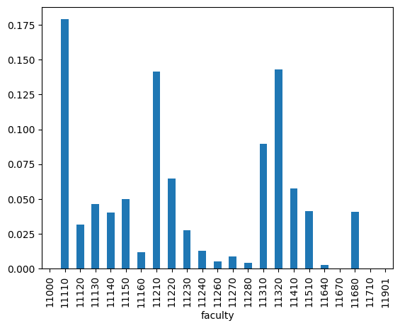
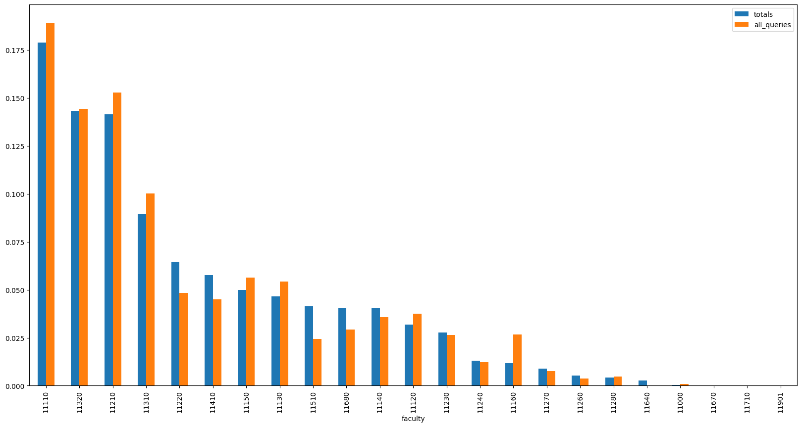
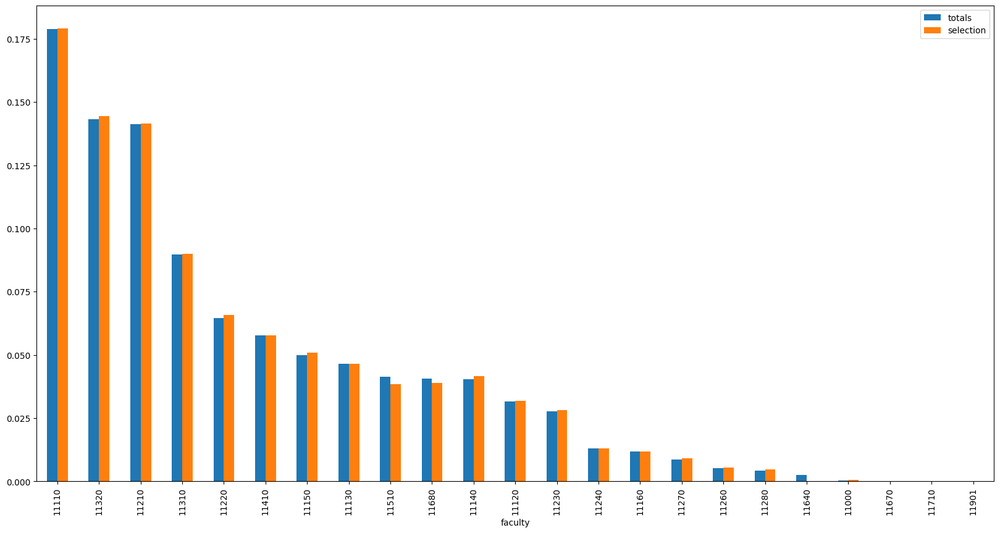

# Benchmarking Charles Explorer search result rankings

> This Python notebook shows the process of benchmarking the search result ranking for the Charles Explorer application.
> It is a part of my diploma thesis at the Faculty of Mathematics and Physics, Charles University, Prague.
>
> Find out more about the thesis in the [GitHub repository](https://github.com/barjin/master-thesis).
>
> Made by Jindřich Bär, 2024. 

In the thesis, we are trying to evaluate the benefits of using graph data metrics for reranking search results in an academic-purpose search engine. 
To carry out the evaluation, we need to establish a benchmarking process first. This notebook shows the process of benchmarking the search result ranking for the Charles Explorer application.

## Creating the benchmark

Many search ranking metrics (e.g. DCG, nDCG etc.) require information about user-item interaction. This is used as a relevance signal to evaluate the quality of the ranking - if the ranking being evaluated ranks user-relevant items higher than irrelevant ones, it receives a higher score.

Unfortunately, the usage data from the Charles Explorer application are not statistically significant yet.

A proxy for an item relevance can be its *position in other search engines' results*. By observing the result ranking for a given query in a different search engine, we can assign a relevance score to each item in the Charles Explorer search results. This relevance score can then be used to evaluate the quality of the ranking and can serve as a measure for the search engine's performace, if we try to optimize it.

There are multiple academic search engines we can use as the "golden standard" for the benchmarking. [Elsevier's Scopus](https://www.scopus.com/) is one of the most popular academic search engines, with a large database of scientific articles in different fields. We can use it to benchmark the Charles Explorer search results, as Elsevier provides a free API for searching their database.

Other services (e.g. Web of Science, Google Scholar) were also considered, but they either do not provide a free API or have other limitations that make them unsuitable for this purpose - for example, with the Web of Science API, the results cannot be filtered by their affiliation to a particular institution. Since all the results in the Charles Explorer are from Charles University, this might cause at least some of the comparison results to be irrelevant.

### Collecting the queries

As the first step, we need to sample the search query set for the benchmark. Since we want to rule out possible biases - or at least mitigate their impact - we need a large and diverse enough set of queries.

Generating these manually would be time-consuming and error-prone. It might also cause biases, as the queries would be generated by a single person, with a limited perspective, certain preferences and habits.
To solve this issue, we can try to use a wordnet - a lexical language database (English, in our case). We can use it to generate a large set of diverse queries, perhaps less biased than a manually generated set.

We start by acquiring the synset for the lemma "field of study". We then traverse the hyponyms (a word of more specific meaning) of this synset to get a broader set of words. By traversing this relation multiple times, we can search the space of the hyponyms "field of study" and generate a diverse set of queries.

> Note: Preliminary experiments showed that the hyponyms of `field of study` tend to underrepresent medical faculties in the search results. To mitigate this, we add `medicine` as a second starting point for the traversal.


```python
import wn

en = wn.Wordnet('oewn:2023')

ss = en.synsets('field of study') + en.synsets('medicine')

def expand_hyponyms(i: list[wn.Synset], depth: int = 1):
    output = i

    for step in range(depth):
        new_hyponyms = []
        for hypernym in output:
            new_hyponyms += hypernym.hyponyms()

        output += new_hyponyms

    return output

queries = list(set([x.lemmas()[0] for x in expand_hyponyms(ss, 4)]))
queries
```
    ['statin',
     'psephology',
     'finance',
     'pheniramine',
     'topology',
     'prosody',
     'thiopental',
     'NegGram',
     'paediatrics',
     'allergology',
     'spectinomycin',
     'Ponstel',
     'Relanium',
     'baby oil',
     'specific',
     'IP',
     'sleeping capsule',
     'gentian violet',
     'descriptive anthropology',
     'fluvastatin',
     'physical science',

     ...

     'chloramine',
     'acoustics',
     'pharmacokinetics',
     'Pyridium',
     'decongestant',
     'meteorology',
     'sedative',
     'nontricyclic',
     'Cox-2 inhibitor',
     'soup',
     'kagura',
     'block',
     'Mesantoin',
     'asparaginase',
     'physical anthropology',
     'protriptyline',
     'Pravachol',
     'Relafen',
     'fresco',
     'thrombolytic',
     'step dancing']


```python
len(queries)
```


    915


Using the process above, we managed to generate a set of 915 distinct queries - or **query candidates**.

From these, we want to create an unbiased set of queries for the benchmark with respect to the origin faculties of the results.
To measure the faculty-wise bias, we can compare the distribution of the search results over faculties with the distribution of the total publication counts per faculty.

By querying the database, we can retrieve the total publication counts for each faculty and calculate the distribution of publication counts per faculty ($P_{\text{total}}$).


```python
import pandas as pd
import numpy as np
import psycopg2

conn = psycopg2.connect("host=localhost port=5432 dbname=charles_explorer_db user=postgres password=charles_explorer_db_password")

cur = conn.cursor()
cur.execute('SELECT "A" as "faculty", COUNT(*) FROM "_FacultyToPublication" GROUP BY "A";')
records = cur.fetchall()
conn.close()

totals = pd.DataFrame(records, columns=[desc[0] for desc in cur.description])

totals['faculty'] = totals['faculty'].astype(int)
totals['prob'] = totals['count'] / totals['count'].sum()
totals.set_index('faculty', inplace=True)

totals['prob'].plot(kind='bar')
```


    <Axes: xlabel='faculty'>


    

    


Now that we have the totals and sample queries "superset", we can collect the search results from Charles Explorer.

We do this by querying the Charles Explorer API with each query candidate and storing the results as a row in Pandas DataFrame.


```python
import pandas as pd
import requests
from collections import namedtuple
from urllib.parse import urljoin, urlencode, urlparse, urlunparse

def build_url(base_path: str, query: str):
    # namedtuple to match the internal signature of urlunparse
    Components = namedtuple(
        typename='Components', 
        field_names=['scheme', 'netloc', 'url', 'path', 'query', 'fragment']
    )

    query_params = {
        'query': query, 
        '_data': 'routes/$category/index'
    }

    return urlunparse(
        Components(
            scheme='http',
            netloc='localhost:3000',
            query=urlencode(query_params),
            path='',
            url=base_path,
            fragment=''
        )
    )

def find_by_predicate(arr: list[dict], predicate):
    return next((x for x in arr if predicate(x)), None)


def parse_response(response: requests.Response, query: str):
    j = response.json()

    query_ss = en.synsets(query)

    return [
        {
            'id': result['id'],
            'year': result['year'],
            'name': find_by_predicate(result['names'], lambda x: x['lang'] == 'en').get('value') if find_by_predicate(result['names'], lambda x: x['lang'] == 'en') else result['names'][0].get('value'),
            'faculty': len(result['faculties']) > 0 and result['faculties'][0].get('id') or -1,
            'faculty_name': len(result['faculties']) > 0 and find_by_predicate(result['faculties'][0]['names'], lambda x: x['lang'] == 'en').get('value') or 'Unknown faculty',
            'query': query,
        } for result in j['searchResults']
    ]

def get_dataframe_for_queries(queries: list[str]):
    df = pd.DataFrame()

    for i, query in enumerate(list(set(queries))):
        response = requests.get(build_url('/publication', query))
        if i % 30 == 0:
            print(f'Processed {i} queries')
        # print(response.json())
        df = pd.concat([df, pd.DataFrame(parse_response(response, query))])
    
    return df

df = get_dataframe_for_queries(queries)
# Because of the big computational complexity, we store the query results in a file so we can reference them later without having to run the searches again. 
df.to_csv('search_results.csv')
```

    Processed 0 queries
    Processed 30 queries
    Processed 60 queries
    Processed 90 queries
    Processed 120 queries
    Processed 150 queries
    Processed 180 queries
    Processed 210 queries
    Processed 240 queries
    Processed 270 queries
    Processed 300 queries
    Processed 330 queries
    Processed 360 queries
    Processed 390 queries
    Processed 420 queries
    Processed 450 queries
    Processed 480 queries
    Processed 510 queries
    Processed 540 queries
    Processed 570 queries
    Processed 600 queries
    Processed 630 queries
    Processed 660 queries
    Processed 690 queries
    Processed 720 queries
    Processed 750 queries
    Processed 780 queries
    Processed 810 queries
    Processed 840 queries
    Processed 870 queries
    Processed 900 queries


```python
df = pd.read_csv('./search_results.csv');

# we remove the publications that do not have a faculty associated with them - those don't contribute to the distribution of publications per faculty
df = df[~df['faculty'].isin([-1])]
df.reset_index().drop(columns=['index'], inplace=True)
df
```


<div>
<style scoped>
    .dataframe tbody tr th:only-of-type {
        vertical-align: middle;
    }

    .dataframe tbody tr th {
        vertical-align: top;
    }

    .dataframe thead th {
        text-align: right;
    }
</style>
<table border="1" class="dataframe">
  <thead>
    <tr style="text-align: right;">
      <th></th>
      <th>Unnamed: 0</th>
      <th>id</th>
      <th>year</th>
      <th>name</th>
      <th>faculty</th>
      <th>faculty_name</th>
      <th>query</th>
    </tr>
  </thead>
  <tbody>
    <tr>
      <th>0</th>
      <td>0</td>
      <td>612484</td>
      <td>2022.0</td>
      <td>Statins and liver</td>
      <td>11110</td>
      <td>First Faculty of Medicine</td>
      <td>statin</td>
    </tr>
    <tr>
      <th>1</th>
      <td>1</td>
      <td>335691</td>
      <td>2013.0</td>
      <td>Statins and myopathy</td>
      <td>11140</td>
      <td>Faculty of Medicine in Pilsen</td>
      <td>statin</td>
    </tr>
    <tr>
      <th>2</th>
      <td>2</td>
      <td>594199</td>
      <td>2016.0</td>
      <td>Do we use statins enough? News in the combinat...</td>
      <td>11140</td>
      <td>Faculty of Medicine in Pilsen</td>
      <td>statin</td>
    </tr>
    <tr>
      <th>3</th>
      <td>3</td>
      <td>603996</td>
      <td>2021.0</td>
      <td>Statins and COVID-19: Are they each other indi...</td>
      <td>11110</td>
      <td>First Faculty of Medicine</td>
      <td>statin</td>
    </tr>
    <tr>
      <th>4</th>
      <td>4</td>
      <td>503698</td>
      <td>2015.0</td>
      <td>Statins</td>
      <td>11110</td>
      <td>First Faculty of Medicine</td>
      <td>statin</td>
    </tr>
    <tr>
      <th>...</th>
      <td>...</td>
      <td>...</td>
      <td>...</td>
      <td>...</td>
      <td>...</td>
      <td>...</td>
      <td>...</td>
    </tr>
    <tr>
      <th>12509</th>
      <td>25</td>
      <td>287421</td>
      <td>2014.0</td>
      <td>Within-Day and Weekly Variations of Thrombolys...</td>
      <td>11140</td>
      <td>Faculty of Medicine in Pilsen</td>
      <td>thrombolytic</td>
    </tr>
    <tr>
      <th>12510</th>
      <td>26</td>
      <td>594262</td>
      <td>2021.0</td>
      <td>Stroke 20 20: Implementation goals for intrave...</td>
      <td>11150</td>
      <td>Faculty of Medicine in Hradec Králové</td>
      <td>thrombolytic</td>
    </tr>
    <tr>
      <th>12511</th>
      <td>27</td>
      <td>610284</td>
      <td>2022.0</td>
      <td>Stroke thrombectomy (+- thrombolysis), and not...</td>
      <td>11120</td>
      <td>Third Faculty of Medicine</td>
      <td>thrombolytic</td>
    </tr>
    <tr>
      <th>12512</th>
      <td>28</td>
      <td>479107</td>
      <td>2011.0</td>
      <td>How accurately can the aetiology of cardiac ar...</td>
      <td>11680</td>
      <td>Central Library of Charles University</td>
      <td>thrombolytic</td>
    </tr>
    <tr>
      <th>12513</th>
      <td>29</td>
      <td>113007</td>
      <td>2010.0</td>
      <td>Endovascular Recanalization in the Treatment o...</td>
      <td>11150</td>
      <td>Faculty of Medicine in Hradec Králové</td>
      <td>thrombolytic</td>
    </tr>
  </tbody>
</table>
<p>10167 rows × 7 columns</p>
</div>


Having the actual search results, we can now compare its distribution to the distribution of total publication counts per faculty.

For this, we'll be using KL divergence, a measure of how one probability distribution differs from a second, expected probability distribution. The value of KL divergence is always non-negative, with 0 meaning the two distributions are identical.


```python
def get_subdf(df: pd.DataFrame, queries: list[str]):
    return df[df['query'].isin(queries)]

def get_distribution(series: pd.Series):
    return series / series.sum()

def get_series_for_queries(queries: list[str]):
    return get_distribution(get_subdf(df, queries)['faculty'].value_counts().reindex(totals.index, fill_value=0)).fillna(0)
```


```python
def get_kl_divergence(p: np.array, q: np.array):
    return np.sum(p * np.log(p.add(1e-9) / q.add(1e-9)))

print(get_kl_divergence(get_series_for_queries(['modal logic']), totals['prob'])) # only returns results for one faculty (MFF)

print(get_kl_divergence(get_series_for_queries(queries), totals['prob']))
```

    1.4029115694532561
    0.04714136865559425


The example above shows two KL divergence computations. 

The first computation compares the global faculty distribution with the distribution for the query "modal logic" - this query yields only results from the Faculty of Mathematics and Physics. The KL divergence is therefore high - the distribution of results is very different from the global distribution.

The second computation actually compares the faculty distribution on the ~900 sampled queries with the global distribution. The KL divergence is much lower, as the distribution of results is more similar to the global distribution.

### Optimizing the KL divergence

Having defined the KL divergence as our metric, we can now reformulate the search for the unbiased set of queries as a minimization problem. 

We want to *find a subset of queries that **minimizes the KL divergence** between the distribution of search results and the distribution of total publication counts per faculty.*

This problem is unfortunately not much different from the 0-1 Knapsack problem (or the subset sum problem), which are both NP-hard. 
Additionaly, we cannot simply reuse some of the existing algorithms for these problems, as many of those rely on the distributivity and associativity of the sum operation. This is however not the case for the KL divergence. 

Similarly to the sum of the item values (in the Knapsack problem), the KL divergence is evaluated on the entire set, but unlike the sum, the items themselves do not have any "value" - and their contribution to the KL divergence changes depending on the other items in the set. This leaves us with a limited choice of algorithms to solve the problem. Because of the complexity of the problem and its smallish role in this work, we can use a simple random search. By sampling random subsets of a fixed size, we can try finding a subset that minimizes the KL divergence.


```python
query_candidates = df['query'].unique()

def sample_noreplace(arr, n, k):
    assert k <= len(arr)
    idx = np.random.randint(len(arr) - np.arange(k), size=[n, k])
    for i in range(k-1, 0, -1):
        idx[:,i:] += idx[:,i:] >= idx[:,i-1,None]
    return np.array(arr)[idx]

def get_best_queries(target_kl: float, max_epochs: int, n: int = 1000, k: int = 70):
    best_queries = []
    best_divergence = np.inf

    for epoch in range(max_epochs):
        print(f'Epoch {epoch}, best divergence: {best_divergence}')
        query_groups = sample_noreplace(query_candidates, n, k)

        divergences = [get_kl_divergence(get_series_for_queries(x), totals['prob']) for x in query_groups]
        best_query_set = query_groups[np.argmin(divergences)]
        divergence = divergences[np.argmin(divergences)]

        if divergence < best_divergence:
            best_queries = best_query_set
            best_divergence = divergence

        if divergence < target_kl:
            break

    return best_queries

best_query_set = get_best_queries(get_kl_divergence(get_series_for_queries(queries), totals['prob']) / 2, 10, 1000, 300)
```

    Epoch 0, best divergence: inf
    Epoch 1, best divergence: 0.03088109379075798


The randomized search has found a subset of queries that minimize the KL divergence to at least a half of the original value. This subset contains 300 queries, which we can use as the unbiased set of queries for the benchmark.

We can continue by plotting the distribution of search results and the distribution of total publication counts per faculty to see how well the search results represent the publication counts.


```python
pd.DataFrame({
    'totals': totals['prob'],
    'all_queries': get_series_for_queries(best_query_set),
}).sort_values('totals', ascending=False).plot(kind='bar', figsize=(20, 10))
```


    <Axes: xlabel='faculty'>


    

    


Even though the distributions are quite close to each other now, we can still see some of the faculties being overrepresented (and other being underrepresented) in the search results.

To further decrease the KL divergence, we can employ a simple hill climbing (or hill descending, in this case) algorithm. We can start with our random subset and iteratively try to remove a query from the subset. In each step of this process, we remove the query that, when removed, decreases the KL divergence the most. We repeat this process until the KL divergence stops decreasing.

Similarly to SGD, this method can get stuck in a local minimum. While this might cause the algorithm to not find the optimal solution, it should still be able to find a subset of queries with a low KL divergence.


```python
current_divergence = get_kl_divergence(query_totals['prob'], totals['prob'])

new_divergence = 0
while True:
    # try removing one query at a time, seeing which removal reduces the divergence the most
    divergences = []
    for query in best_query_set:
        divergences.append(get_kl_divergence(get_series_for_queries([x for x in best_query_set if x != query]), totals['prob']))
    
    divergences = np.array(divergences)
    new_divergence = divergences.min()
    if new_divergence < current_divergence:
        # if current_divergence - new_divergence:
        #     print(f'No more queries to remove')
        #     break
        print(f'Removing query {best_query_set[np.argmin(divergences)]} reduces divergence to {new_divergence}')
        best_query_set = [x for i,x in enumerate(best_query_set) if i != np.argmin(divergences)]
        current_divergence = new_divergence
    else:
        print(f'No more queries to remove')
        break
```

    Removing query penicillin reduces divergence to 0.016105491350444638
    Removing query pas de trois reduces divergence to 0.015593487703697735
    Removing query anti-inflammatory reduces divergence to 0.015155984041979853
    Removing query alkylating agent reduces divergence to 0.014742787136988946
    Removing query linguistics reduces divergence to 0.01437388632125047
    Removing query vomit reduces divergence to 0.013995391804295524
    Removing query photochemistry reduces divergence to 0.013631156512752046
    Removing query expectorant reduces divergence to 0.013271099062614571
    Removing query audiometry reduces divergence to 0.01295389196069935
    Removing query sociolinguistics reduces divergence to 0.012613359059161467
    Removing query antiprotozoal reduces divergence to 0.01230794480221695
    Removing query linear programming reduces divergence to 0.012025689986302714
    Removing query NSAID reduces divergence to 0.0117049979000795
    Removing query sulfadiazine reduces divergence to 0.011442551618439099
    Removing query frontier reduces divergence to 0.011166341603609633
    Removing query hydroxychloroquine reduces divergence to 0.010869342262337331
    Removing query freeze reduces divergence to 0.010617804931890167
    Removing query history reduces divergence to 0.01037022471793504
    Removing query antidiuretic reduces divergence to 0.010111961592201575
    Removing query mechanical engineering reduces divergence to 0.009851994516792181
    Removing query laxative reduces divergence to 0.009616712686632136
    Removing query dermatology reduces divergence to 0.009400117125337445
    Removing query genealogy reduces divergence to 0.009170328760585428
    Removing query radiopharmaceutical reduces divergence to 0.00895568915479433
    Removing query topology reduces divergence to 0.008722330414410707
    Removing query psychodynamics reduces divergence to 0.008482114095765478
    Removing query geochemistry reduces divergence to 0.008234283046945087
    Removing query poetics reduces divergence to 0.008000773290104254
    Removing query spasmolytic reduces divergence to 0.007785975076860612
    Removing query bioscience reduces divergence to 0.007605583927328279
    Removing query rhetoric reduces divergence to 0.00742463703721507
    Removing query pharmacokinetics reduces divergence to 0.007235321971843382
    Removing query high energy physics reduces divergence to 0.007003329499052894
    Removing query immunology reduces divergence to 0.0068278835555687775
    Removing query dialectic reduces divergence to 0.0066355710980884235
    Removing query diltiazem reduces divergence to 0.0064749145945258825
    Removing query capsule reduces divergence to 0.006332669209236989
    Removing query variation reduces divergence to 0.0061831708138719126
    Removing query menthol reduces divergence to 0.006057261977463686
    Removing query econometrics reduces divergence to 0.005938469602979169
    Removing query epidemiology reduces divergence to 0.005790835727612971
    Removing query Oriental Studies reduces divergence to 0.0056524881017620725
    Removing query beta blocker reduces divergence to 0.0055374731213476
    Removing query civics reduces divergence to 0.0054193257071314515
    Removing query taxonomy reduces divergence to 0.005312823010956788
    Removing query otolaryngology reduces divergence to 0.0051872734103167485
    Removing query classical philology reduces divergence to 0.005067817612199804
    Removing query virology reduces divergence to 0.004973629393371306
    Removing query set theory reduces divergence to 0.004868857811316672
    Removing query nuclear medicine reduces divergence to 0.004781839591283388
    Removing query natural science reduces divergence to 0.004700693563307107
    Removing query Occidentalism reduces divergence to 0.0046300243421567066
    Removing query SSRI reduces divergence to 0.004548713128497094
    Removing query cosmography reduces divergence to 0.0044842917218509805
    Removing query oxytetracycline reduces divergence to 0.0044199835921090586
    Removing query barbiturate reduces divergence to 0.004368837971897515
    Removing query object reduces divergence to 0.004308423062073141
    Removing query alpha blocker reduces divergence to 0.0042450953249444255
    Removing query oceanography reduces divergence to 0.004192541566260031
    Removing query quantum physics reduces divergence to 0.004151420293851628
    Removing query dose reduces divergence to 0.004098453004089903
    Removing query phonemics reduces divergence to 0.004035013976505352
    Removing query power engineering reduces divergence to 0.0039951033390309585
    Removing query aeronautics reduces divergence to 0.003967212944591768
    Removing query strategics reduces divergence to 0.003938690465785155
    Removing query streptomycin reduces divergence to 0.0039054473602914037
    Removing query ology reduces divergence to 0.0038749510271096337
    Removing query English reduces divergence to 0.0038420646599258883
    Removing query polymyxin reduces divergence to 0.0038097651743487864
    Removing query computational linguistics reduces divergence to 0.003778289249139709
    Removing query codeine reduces divergence to 0.0037391257265411474
    Removing query cultural studies reduces divergence to 0.0037007293385864447
    Removing query medicine reduces divergence to 0.003659366111778401
    Removing query chemical engineering reduces divergence to 0.0036304184058123766
    Removing query cryptography reduces divergence to 0.0036104536260615078
    Removing query structural linguistics reduces divergence to 0.003589262499551347
    Removing query atropine reduces divergence to 0.003550016448961152
    Removing query Indocin reduces divergence to 0.0035348400120714467
    Removing query alpha-interferon reduces divergence to 0.0035195748319500272
    Removing query application reduces divergence to 0.0034988921641933455
    Removing query complementary medicine reduces divergence to 0.0034750675271526337
    Removing query hydraulic engineering reduces divergence to 0.0034566931778127487
    Removing query antimetabolite reduces divergence to 0.0034360798569208297
    Removing query disulfiram reduces divergence to 0.0034192066261994935
    Removing query hermeneutics reduces divergence to 0.0034013913935241787
    Removing query tubocurarine reduces divergence to 0.0033846736202896932
    Removing query theory of probability reduces divergence to 0.003366610698795755
    Removing query sedative-hypnotic reduces divergence to 0.0033509682412260376
    Removing query dermatoglyphics reduces divergence to 0.0033384667678033842
    Removing query human ecology reduces divergence to 0.0033245508498037195
    Removing query sulfanilamide reduces divergence to 0.003311749513610583
    Removing query orthodontia reduces divergence to 0.0033047967004089995
    Removing query yellow jacket reduces divergence to 0.003297533665479544
    Removing query behaviorism reduces divergence to 0.0032897518571533115
    Removing query neuropsychiatry reduces divergence to 0.00326810919682544
    Removing query castor oil reduces divergence to 0.0032514546415738244
    Removing query chemical science reduces divergence to 0.003239460477727438
    Removing query strategy reduces divergence to 0.003230062278393327
    Removing query cephalothin reduces divergence to 0.003222187605007859
    Removing query Paxil reduces divergence to 0.003217801027944129
    Removing query hydromorphone reduces divergence to 0.003213321464772427
    Removing query salol reduces divergence to 0.003208603977272919
    Removing query patent medicine reduces divergence to 0.0032038695454998873
    Removing query antimycin reduces divergence to 0.0031998468918678423
    Removing query symbology reduces divergence to 0.0031946072720307602
    Removing query sulindac reduces divergence to 0.003193170076465984
    Removing query demulcent reduces divergence to 0.0031917975765188658
    Removing query military science reduces divergence to 0.0031902106212587018
    Removing query peace and conflict studies reduces divergence to 0.00318909131528973
    Removing query ritual dance reduces divergence to 0.003187852837685122
    Removing query biomedicine reduces divergence to 0.003185264035967492
    Removing query landscape architecture reduces divergence to 0.0031813441642548675
    Removing query Glucotrol reduces divergence to 0.00317780811369104
    Removing query thioguanine reduces divergence to 0.003175405864741112
    Removing query pure mathematics reduces divergence to 0.0031740782329779628
    Removing query tyrothricin reduces divergence to 0.003173120688959345
    Removing query sulfamethazine reduces divergence to 0.0031722794314617488
    Removing query tranquilizer reduces divergence to 0.003171322366645038
    Removing query animal psychology reduces divergence to 0.0031709345772320202
    No more queries to remove


We can see that the algorithm was able to find a set of queries with a KL divergence of 0.0031, a value 10 times lower than the initial KL divergence of 0.03.

Looking into the logs, we can also see that the removed queries are mostly those that are very specific to a single faculty (especially medical terms). This is in line with our intuition - the queries that are too specific to a single faculty are likely to cause a high KL divergence from the global distribution.


```python
pd.DataFrame({
    'totals': totals['prob'],
    'selection': get_series_for_queries(best_query_set),
}).sort_values('totals', ascending=False).plot(kind='bar', figsize=(20, 10))
```


    <Axes: xlabel='faculty'>


    

    


We can now store the optimized set of queries and use it for the benchmarking.


```python
pd.Series(best_query_set).to_csv('best_queries.csv')
```


    ---------------------------------------------------------------------------

    NameError                                 Traceback (most recent call last)

    Cell In[3], line 1
    ----> 1 pd.Series(best_query_set).to_csv('best_queries.csv')


    NameError: name 'best_query_set' is not defined


```python
import pandas as pd

# Now that we have the best queries, we can retrieve the search results with their respective positions (0-30)
# Because we've removed the no-faculty publications, we need to reload the search results dataframe from the stored file.

best_query_set = pd.read_csv('best_queries.csv')['0'].tolist()
df = pd.read_csv('./search_results.csv');
```

After loading, we can now filter the search results to only include the best queries.


```python
df[df['query'].isin(best_query_set)]
```


<div>
<style scoped>
    .dataframe tbody tr th:only-of-type {
        vertical-align: middle;
    }

    .dataframe tbody tr th {
        vertical-align: top;
    }

    .dataframe thead th {
        text-align: right;
    }
</style>
<table border="1" class="dataframe">
  <thead>
    <tr style="text-align: right;">
      <th></th>
      <th>Unnamed: 0</th>
      <th>id</th>
      <th>year</th>
      <th>name</th>
      <th>faculty</th>
      <th>faculty_name</th>
      <th>query</th>
    </tr>
  </thead>
  <tbody>
    <tr>
      <th>30</th>
      <td>0</td>
      <td>140800</td>
      <td>2011.0</td>
      <td>Basics of finance</td>
      <td>-1</td>
      <td>Unknown faculty</td>
      <td>finance</td>
    </tr>
    <tr>
      <th>31</th>
      <td>1</td>
      <td>117899</td>
      <td>2010.0</td>
      <td>On Municipalities and their Finances</td>
      <td>11210</td>
      <td>Faculty of Arts</td>
      <td>finance</td>
    </tr>
    <tr>
      <th>32</th>
      <td>2</td>
      <td>145860</td>
      <td>2011.0</td>
      <td>Personal Finance</td>
      <td>11210</td>
      <td>Faculty of Arts</td>
      <td>finance</td>
    </tr>
    <tr>
      <th>33</th>
      <td>3</td>
      <td>38694</td>
      <td>2009.0</td>
      <td>Finance and Financial Activity of the State</td>
      <td>11220</td>
      <td>Faculty of Law</td>
      <td>finance</td>
    </tr>
    <tr>
      <th>34</th>
      <td>4</td>
      <td>31340</td>
      <td>2009.0</td>
      <td>The Reform of Public Finance in the Czech Repu...</td>
      <td>11220</td>
      <td>Faculty of Law</td>
      <td>finance</td>
    </tr>
    <tr>
      <th>...</th>
      <td>...</td>
      <td>...</td>
      <td>...</td>
      <td>...</td>
      <td>...</td>
      <td>...</td>
      <td>...</td>
    </tr>
    <tr>
      <th>12509</th>
      <td>25</td>
      <td>287421</td>
      <td>2014.0</td>
      <td>Within-Day and Weekly Variations of Thrombolys...</td>
      <td>11140</td>
      <td>Faculty of Medicine in Pilsen</td>
      <td>thrombolytic</td>
    </tr>
    <tr>
      <th>12510</th>
      <td>26</td>
      <td>594262</td>
      <td>2021.0</td>
      <td>Stroke 20 20: Implementation goals for intrave...</td>
      <td>11150</td>
      <td>Faculty of Medicine in Hradec Králové</td>
      <td>thrombolytic</td>
    </tr>
    <tr>
      <th>12511</th>
      <td>27</td>
      <td>610284</td>
      <td>2022.0</td>
      <td>Stroke thrombectomy (+- thrombolysis), and not...</td>
      <td>11120</td>
      <td>Third Faculty of Medicine</td>
      <td>thrombolytic</td>
    </tr>
    <tr>
      <th>12512</th>
      <td>28</td>
      <td>479107</td>
      <td>2011.0</td>
      <td>How accurately can the aetiology of cardiac ar...</td>
      <td>11680</td>
      <td>Central Library of Charles University</td>
      <td>thrombolytic</td>
    </tr>
    <tr>
      <th>12513</th>
      <td>29</td>
      <td>113007</td>
      <td>2010.0</td>
      <td>Endovascular Recanalization in the Treatment o...</td>
      <td>11150</td>
      <td>Faculty of Medicine in Hradec Králové</td>
      <td>thrombolytic</td>
    </tr>
  </tbody>
</table>
<p>3634 rows × 7 columns</p>
</div>


We can see that the filtered data indeed contains results from various faculties.

On top of this, we also have the result ranking for each query in the `Unnamed: 0` column. We can use this data in the DCG calculation.


```python
df.rename(columns={'Unnamed: 0': 'position'})
```


<div>
<style scoped>
    .dataframe tbody tr th:only-of-type {
        vertical-align: middle;
    }

    .dataframe tbody tr th {
        vertical-align: top;
    }

    .dataframe thead th {
        text-align: right;
    }
</style>
<table border="1" class="dataframe">
  <thead>
    <tr style="text-align: right;">
      <th></th>
      <th>position</th>
      <th>id</th>
      <th>year</th>
      <th>name</th>
      <th>faculty</th>
      <th>faculty_name</th>
      <th>query</th>
    </tr>
  </thead>
  <tbody>
    <tr>
      <th>0</th>
      <td>0</td>
      <td>612484</td>
      <td>2022.0</td>
      <td>Statins and liver</td>
      <td>11110</td>
      <td>First Faculty of Medicine</td>
      <td>statin</td>
    </tr>
    <tr>
      <th>1</th>
      <td>1</td>
      <td>335691</td>
      <td>2013.0</td>
      <td>Statins and myopathy</td>
      <td>11140</td>
      <td>Faculty of Medicine in Pilsen</td>
      <td>statin</td>
    </tr>
    <tr>
      <th>2</th>
      <td>2</td>
      <td>594199</td>
      <td>2016.0</td>
      <td>Do we use statins enough? News in the combinat...</td>
      <td>11140</td>
      <td>Faculty of Medicine in Pilsen</td>
      <td>statin</td>
    </tr>
    <tr>
      <th>3</th>
      <td>3</td>
      <td>603996</td>
      <td>2021.0</td>
      <td>Statins and COVID-19: Are they each other indi...</td>
      <td>11110</td>
      <td>First Faculty of Medicine</td>
      <td>statin</td>
    </tr>
    <tr>
      <th>4</th>
      <td>4</td>
      <td>503698</td>
      <td>2015.0</td>
      <td>Statins</td>
      <td>11110</td>
      <td>First Faculty of Medicine</td>
      <td>statin</td>
    </tr>
    <tr>
      <th>...</th>
      <td>...</td>
      <td>...</td>
      <td>...</td>
      <td>...</td>
      <td>...</td>
      <td>...</td>
      <td>...</td>
    </tr>
    <tr>
      <th>12509</th>
      <td>25</td>
      <td>287421</td>
      <td>2014.0</td>
      <td>Within-Day and Weekly Variations of Thrombolys...</td>
      <td>11140</td>
      <td>Faculty of Medicine in Pilsen</td>
      <td>thrombolytic</td>
    </tr>
    <tr>
      <th>12510</th>
      <td>26</td>
      <td>594262</td>
      <td>2021.0</td>
      <td>Stroke 20 20: Implementation goals for intrave...</td>
      <td>11150</td>
      <td>Faculty of Medicine in Hradec Králové</td>
      <td>thrombolytic</td>
    </tr>
    <tr>
      <th>12511</th>
      <td>27</td>
      <td>610284</td>
      <td>2022.0</td>
      <td>Stroke thrombectomy (+- thrombolysis), and not...</td>
      <td>11120</td>
      <td>Third Faculty of Medicine</td>
      <td>thrombolytic</td>
    </tr>
    <tr>
      <th>12512</th>
      <td>28</td>
      <td>479107</td>
      <td>2011.0</td>
      <td>How accurately can the aetiology of cardiac ar...</td>
      <td>11680</td>
      <td>Central Library of Charles University</td>
      <td>thrombolytic</td>
    </tr>
    <tr>
      <th>12513</th>
      <td>29</td>
      <td>113007</td>
      <td>2010.0</td>
      <td>Endovascular Recanalization in the Treatment o...</td>
      <td>11150</td>
      <td>Faculty of Medicine in Hradec Králové</td>
      <td>thrombolytic</td>
    </tr>
  </tbody>
</table>
<p>12514 rows × 7 columns</p>
</div>


