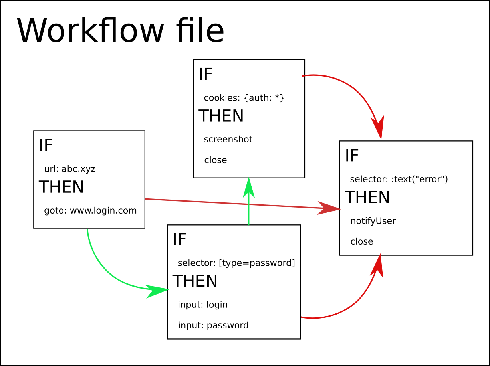
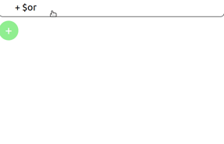

# Thesis Proposal - Web Scraping Framework / Workflow Definition Format

>\[TLDR\]: A working demo of the project, along with some (rather sparse) documentation is available in [this GitHub repository](https://github.com/barjin/wbr/). 

>Are you interested in the [competition analysis](./competition_analysis.md)?

Web scraping and data extraction from the Web is an ever-growing industry, valued at USD 420.84 million in 2019, expected to reach a market value of USD 948.60 million by 2026, growing at a 13.1% CAGR. ([Market Research Future, November 2020](https://www.marketresearchfuture.com/reports/web-scraper-software-market-10347))

This booming industry lacks a universal, safe format for web workflow description, as virtually all scrapers/crawlers/automations are distributed in the form of executable code as of now. This introduces a security risk while sharing those, as well as hinders the performance of the developers, who have to deal with language constructs and programming obstacles.

## Workflow definition

The **Web Automation Workflow** format aims to serve as a declarative format for defining resilient and reusable web automations. Standardized syntax ensures machine (and human) readability, quick parsing, and simple development of third-party applications operating with the format.

From a high-level point of view, the workflow definition declares a set of **action sequences** with their respective **conditions**, not unlike pattern matching-based languages (Prolog, Haskell).

> The green arrows show the intended flow of the web automation, however, the conditions allow for arbitrary order of execution (e.g. red arrows in case of an error). 

In the `IF` clauses, the format allows for extensive usage of prepositional logic, allowing the developer to tailor the conditions to their specific use case. 

The format itself is framework-agnostic, meaning it can be used with various web automation frameworks (think [Playwright](https://playwright.dev/), [Puppeteer](https://github.com/puppeteer/puppeteer)...).

The other part of the thesis would therefore be an **interpreter** of this format, binding this "Condition-Response" generic format with a high-performance, safe implementation.

## Workflow interpreter

When done with editing, the user can run the workflow using the _interpreter_ - a piece of software capable of running the described workflow.

The interpreter itself should be taking care of (mainly): 
- correct **workflow parsing**
- **syntax checking**
- evaluating the **logic conditions** in the dynamic environment of the web browser
- **correct parallelism** - the workflow definition works with an environment with Markov property - the same **workflow definition** can be used in many parallel tabs at the same time.
- **implementing the actions** themselves. These should include (but not be limited to) regular web automation library methods, e.g. methods of [Playwright's class `Page`](https://playwright.dev/docs/api/class-page)
    - The additional actions might facilitate data extraction from the web, export data from the web in a machine readable format etc.

## Workflow editor

While the workflow files should be human readable, there should be a user-friendly editor allowing developers to create the workflows without having to worry about the format's syntax. 

Therefore, there should be a third part of the project - the editor. This would be a web application enabling the users to create **Web Automation Workflows** using a modern and simple graphical interface.

Additionally, this editor might a various number of checks to test whether the workflow is semantically correct, e.g. the conditions are not contradictory, all steps are reachable etc.

___

Jindřich Bär, 2022